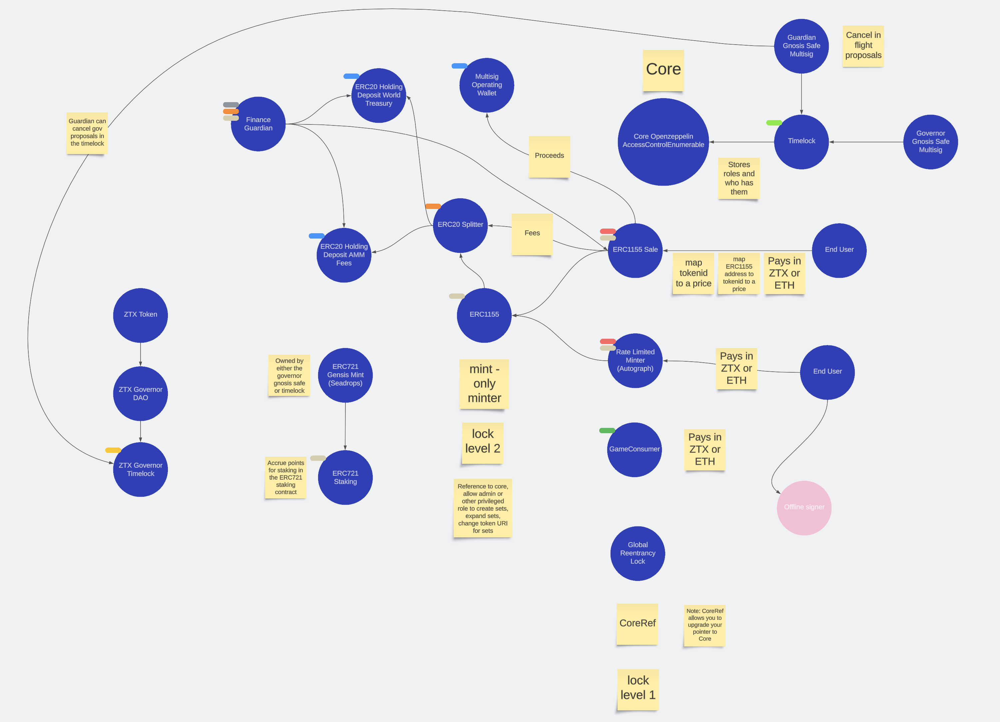

# ZTX Protocol Contracts

## Introduction
The protocol is built on a set of interconnected Solidity smart contracts that are designed to manage access controls, handle various token transactions (including `ERC1155` and `ERC721` tokens), implement staking functionalities, and establish a decentralized autonomous organization (DAO) for governance. The system is constructed to prevent reentrancy attacks with a global lock, and to enable pause/unpause mechanisms for emergencies.

### Overview

## Components
The primary components are as follows:
### Core
- [Core](contracts/core/Core.md)
- [GlobalReentrancyLock](contracts/core/GlobalReentrancyLock.md)
  - [IGlobalReentrancyLock](contracts/core/IGlobalReentrancyLock.md)
- [Roles](contracts/core/Roles.md)
- [CoreRef](contracts/refs/CoreRef.md)
### Finance
- [DepositBase](contracts/finance/DepositBase.md)
  - [IDepositBase](contracts/finance/IDepositBase.md)
- [ERC20HoldingDeposit](contracts/finance/ERC20HoldingDeposit.md)
- [ERC20Splitter](contracts/finance/ERC20Splitter.md)
- [FinanceGuardian](contracts/finance/FinanceGuardian.md)
  - [IFinanceGuardian](contracts/finance/IFinanceGuardian.md)
### Game
- [GameConsumer](contracts/game/GameConsumer.md)
### Governance
- [GovernorDAO](contracts/governance/GovernorDAO.md)
### NFTs
- [ERC1155AutoGraphMiner](contracts/nfts/ERC1155AutoGraphMiner.md)
- [ERC1155MaxSupplyMintable](contracts/nfts/ERC1155MaxSupplyMintable.md)
- [ActualERC721Staking](contracts/nfts/staking/ActualERC721Staking.md)
  - [IActualERC721Staking](contracts/nfts/staking/IActualERC721Staking.md)
### Sale
- [ERC1155Sale](contracts/sale/ERC1155Sale.md)
### Token
- [Token](contracts/token/Token.md)
### Utils
- [RateLimited](contracts/utils/extensions/RateLimited.md)
- [WhitelistedAddresses](contracts/utils/extensions/WhitelistedAddresses.md)
  - [IWhitelistedAddresses](contracts/utils/extensions/IWhitelistedAddresses.md)

## Features
Game-related functionality:
- [Crafting](features/Crafting.md)
- [Harvesting](features/Harvesting.md)

## Known Issues
- Governance is trusted. If `ADMIN` goes rogue it can brick the entire system and steal all funds. 
- If `Core` sets global reentrancy lock to an invalid lock, the entire system is frozen until this value is set back to a valid lock. 
- If `ADMIN` sets pointer to `Core` on `CoreRef` to an invalid `Core` contract, the contract is frozen forever and will not be recoverable as ACL rules will not work.
- If `ADMIN` performs an emergency pause, the entire system that uses global reentrancy locks is frozen until `ADMIN` unpauses it. 
- `emergencyAction()` allows `ADMIN` to execute any action on any contract. If `ADMIN` goes rogue, they can steal all funds as well as brick the `GlobalReentrancyLock` by calling lock and not unlocking.
- If a user makes a purchase from `ERC1155Sale` and pays in ETH and then an emergency arises and funds need to be pulled from `ERC1155Sale`, the raw ETH cannot be immediately pulled and `wrapEth()` must be called before funds can be pulled.
- `ERC1155Sale` must be correctly configured to have `WETH` as the underlying asset for pairs that use ETH as the quote asset. If this is not done, `ERC1155Sale` will not work correctly as users will not be able to purchase tokens with raw ETH due to failing the check.
- `ADMIN` is `ADMIN` of `ADMIN` in Core, which means that it can add and revoke itself and others with this role.
- `withdrawERC20()` in `ERC1155Sale` breaks internal accounting and is _ONLY_ to be used in an emergency.
