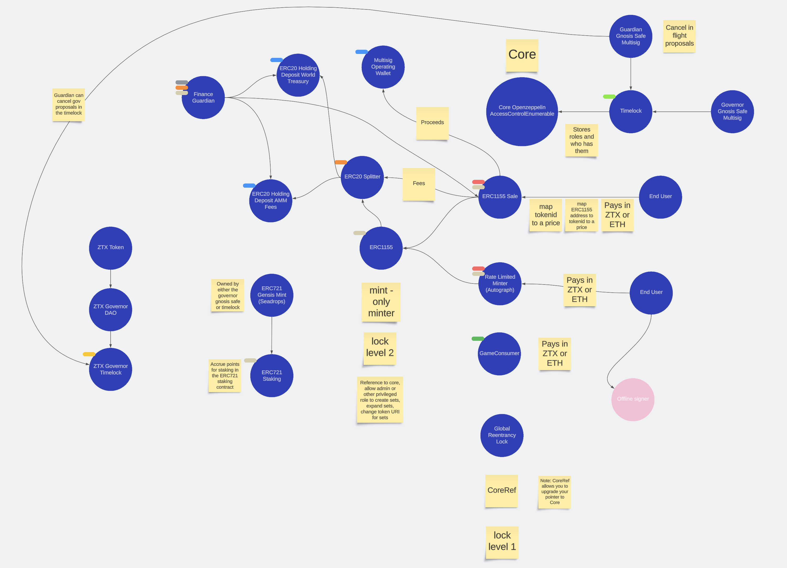

# System Architecture Documentation

## Overview

The system architecture is primarily built on a set of interconnected Ethereum smart contracts designed to manage access controls, handle various token transactions (including ERC1155 and ERC721 tokens), implement staking functionalities, and establish a decentralized autonomous organization (DAO) for governance. The system is constructed to prevent reentrancy attacks with a global lock, and to enable pause/unpause mechanisms for emergencies.

## Components

This system's main components are `Core`, `CoreRef`, `ERC1155`, `ERC1155Sale`, `ERC721Staking`, `ERC20Splitter`, `ERC20HoldingDeposit`, `GovernorDAO`, `TimelockController` and `FinanceGuardian`. The `Core` contract is the fundamental base of the system, managing roles and the pointer to the global reentrancy lock. `CoreRef` is a contract that references the `Core`, checking access controls when contracts are called according to the protocol's Access Control List (ACL) in `Core`.

## ERC1155
The `ERC1155` and `ERC1155Sale` contracts handle ERC1155 token transactions and sales. This ERC1155 contract keeps track of each tokenId's maximum supply and current total supply. Minting can only happen when the new total supply is less than or equal to the supply cap for the tokenId. The ERC1155Sale contract is used for selling ERC1155 tokens to end users. This contract has two modes, a whitelist mode, and a non whitelist mode. If the whitelist is used, each user is only allowed to purchase up to their alloted amount of tokens. If there is no whitelist, there is no cap on how much any one user can purchase. There is also a sale start time, which must be in the future, so the asset listing can be created now, and only go live sometime in the future.

## ERC721 Staking
The `ERC721Staking` contract manages staking for ERC721 tokens.

## ERC20 Operations
The `ERC20Splitter` and `ERC20HoldingDeposit` contracts handle operations for ERC20 tokens, including splitting and deposit functionalities.

## Governance
The `GovernorDAO` is a contract representing a decentralized governance system, enabling token holders to propose and vote on various decisions related to the system. The `FinanceGuardian` oversees the financial aspects of the contracts, having unique permissions and abilities to pull funds to a safe address in case of emergencies. The `TimelockController` is where all governance proposals are executed through. This contract will have the token governor role as this enforces all proposals must pass through the timelock to succeed. The Guardian multisig will have the canceller role in the timelock which will allow it to cancel proposals.

## Component Interaction

1. **Core and CoreRef**: `CoreRef` keeps a pointer to `Core`, checking access controls according to the protocol's ACL via its modifiers. Any other contract that requires access control or role management would inherit from `CoreRef`.

2. **Access Control**: `Core` uses the OpenZeppelin's `AccessControlEnumerable` for role-based access control. It handles the assigning and revoking of roles, which is critical in managing access to specific functions across the system.

3. **Global Reentrancy Lock**: `Core` contract holds the reference to the `GlobalReentrancyLock`. This lock is used within the `globalLock` modifier in `CoreRef`, which is applied to functions across the system that require reentrancy protection. The global reentrancy lock stops any potential reentrancy from occuring by guarding all functions the modifier is used on.

4. **ERC1155 and ERC1155Sale**: `ERC1155Sale` mints users `ERC1155` tokens when they pay the specified price. The `ERC1155` contract handles minting, burning, transferring, and approval of ERC1155 tokens, while `ERC1155Sale` would control the sale mechanics. The ERC1155Sale contract tracks where revenues came from, and then routes revenues to the specified recipients.

5. **ERC721Staking**: This contract allows users to stake their ERC721 tokens in exchanges for non-transferrable points rewards.

6. **ERC20Splitter and ERC20HoldingDeposit**: These contracts handle operations for ERC20 tokens, with the `ERC20Splitter` responsible for splitting ERC20 tokens among multiple recipients, and `ERC20HoldingDeposit` used to hold deposits of ERC20 tokens. These contracts would interact directly with the ERC20 tokens and are controlled via modifiers from `CoreRef` that check roles in `Core`.

7. **GovernorDAO**: The `GovernorDAO` is responsible for decentralized governance. It would interact with the ERC20 token that represents voting shares in the DAO. It may also interact with `Core` for role-based access control, and with the other contracts to enforce governance decisions.

8. **FinanceGuardian**: This contract inherits `CoreRef` for access control and interacts with token holding contracts to pull funds to a safe address in case of emergencies. The token governor, the guardian, the financial guardian and the admin can all use this contract to pull funds from compromised deposits.

## System Architecture Diagram

