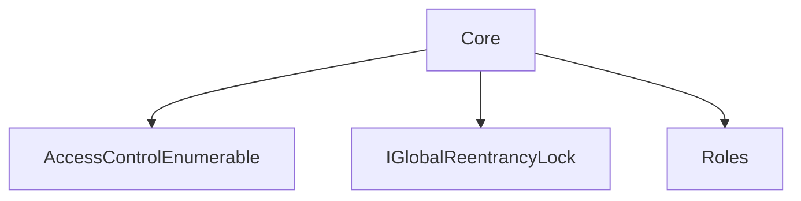
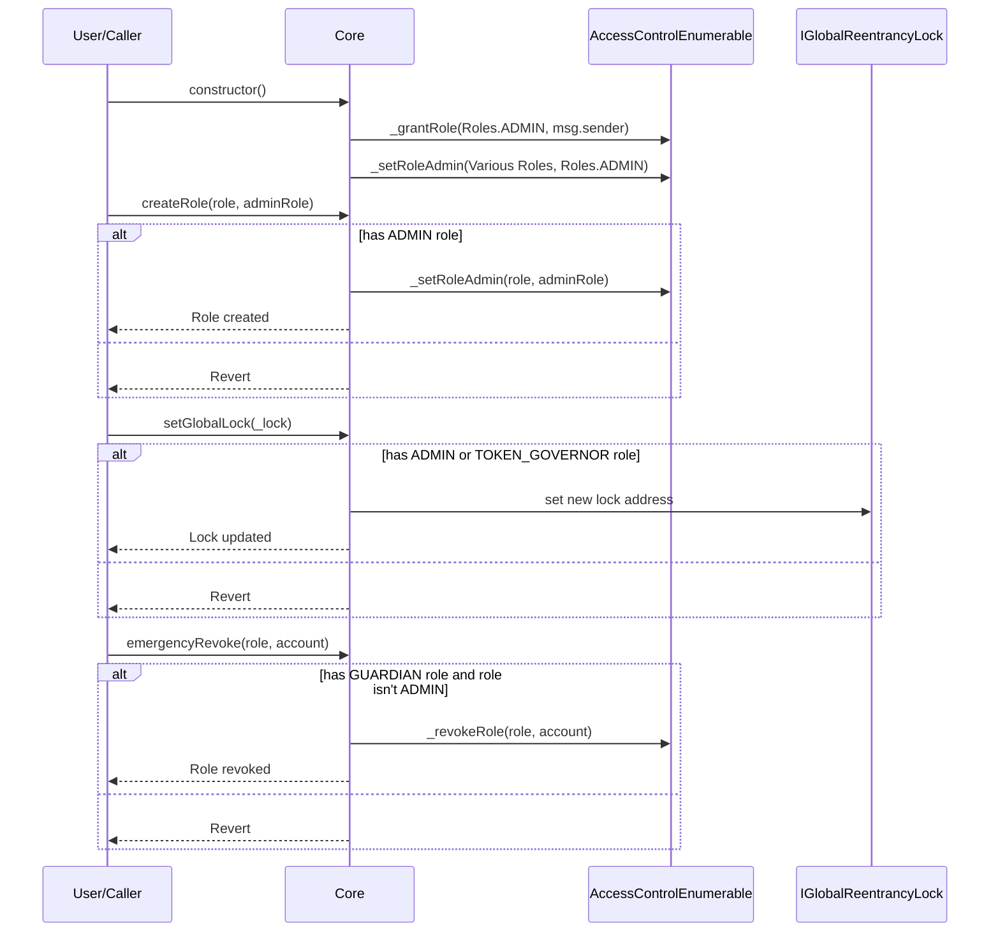

# Core.md

## Introduction
This contract is a foundational pillar in the ZTX protocol, emphasizing robust role-based access management and a systemic defense against reentrancy attacks. It harmoniously brings together critical functionalities to ensure system integrity, safety, and modularity.

### Overview
The diagrams below provide a visual representation of how `Core.sol` interacts with its various features and dependencies. It primarily shows the flow of actions a user can initiate and how the contract interacts with other referenced contracts and utilities.

#### Top-down

#### Sequence

## Base Contracts
### OpenZeppelin
- [AccessControlEnumerable](https://github.com/OpenZeppelin/openzeppelin-contracts/blob/master/contracts/access/extensions/AccessControlEnumerable.sol): provides role-based access control. It allows the creation of different roles and permissions for those roles, ensuring that only authorized addresses can call certain functions.
### Protocol Specific
- [Roles](https://github.com/ZTX-Foundation/tuxedo/blob/develop/src/core/Roles.sol): Defines the various roles utilized within the system.
- [IGlobalReentrancyLock](https://github.com/ZTX-Foundation/tuxedo/blob/develop/src/core/IGlobalReentrancyLock.sol): An interface for `GlobalReentrancyLock`.

## Features
- Inherits from OpenZeppelin's `AccessControlEnumerable`, meaning it can define a flexible set of roles and permissions. Each role can have an associated admin role, and only accounts with the admin role can grant or revoke the associated role from other accounts.
- On deployment, several roles are defined. The `ADMIN` role is granted to the account that deploys the contract, and it's the highest level of permission.
- The `createRole()` function allows the `ADMIN` to dynamically create new roles and specify their admin roles. This offers flexibility in expanding the role-based access system as the protocol grows.
- The `emergencyRevoke()` function provides a mechanism for the `GUARDIAN` role to revoke roles from accounts in case of emergencies. However, the guardian cannot revoke the `ADMIN` role. This ensures that in the event of a security threat or other issues, rapid action can be taken.
- The contract holds a reference to a global reentrancy lock (of type `IGlobalReentrancyLock`) named lock.
- The `setGlobalLock()` function allows the `ADMIN` or `TOKEN_GOVERNOR` roles to update the address of the reentrancy lock.
