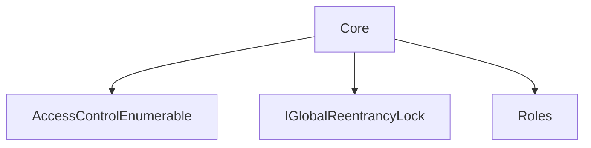
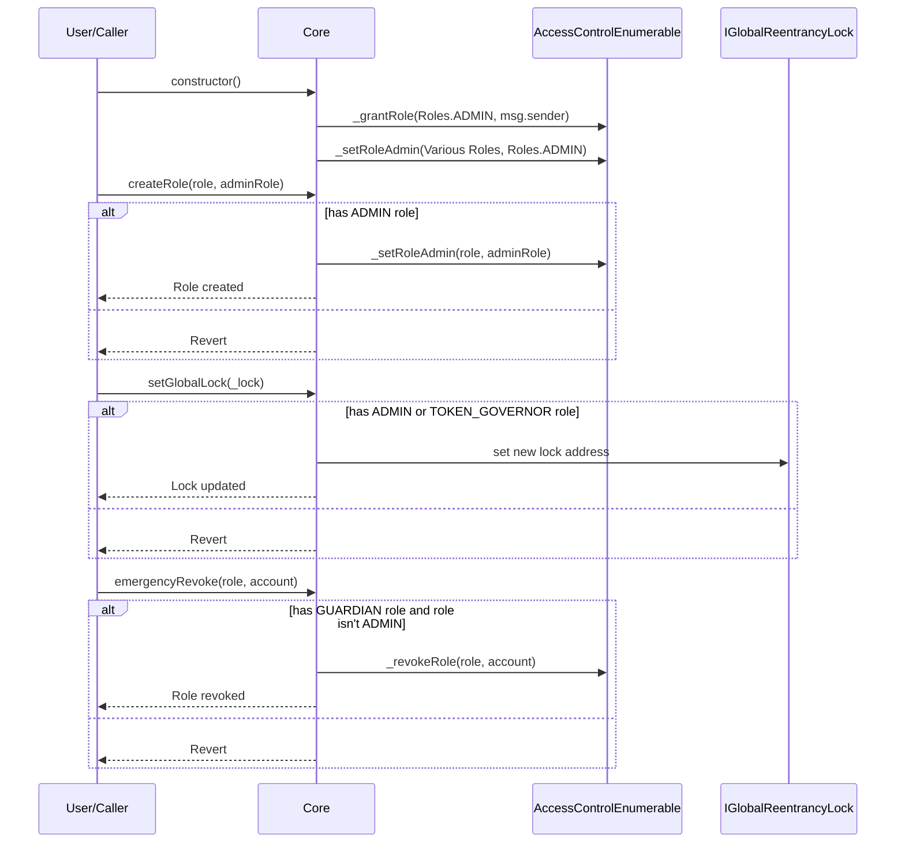

# Core.md

## Introduction
This contract is a foundational pillar in the ZTX protocol, emphasizing robust role-based access management and a systemic defense against reentrancy attacks. It harmoniously brings together critical functionalities to ensure system integrity, safety, and modularity.

### Overview
The diagrams below provide a visual representation of how `Core.sol` interacts with its various features and dependencies. It primarily shows the flow of actions a user can initiate and how the contract interacts with other referenced contracts and utilities.

#### Top-down

#### Sequence

## Base Contracts
### OpenZeppelin
- [AccessControlEnumerable](https://github.com/OpenZeppelin/openzeppelin-contracts/blob/master/contracts/access/extensions/AccessControlEnumerable.sol): provides role-based access control. It allows the creation of different roles and permissions for those roles, ensuring that only authorized addresses can call certain functions.
### Protocol Specific
- [Roles](https://github.com/ZTX-Foundation/tuxedo/blob/develop/src/core/Roles.sol): Defines the various roles utilized within the system.
- [IGlobalReentrancyLock](https://github.com/ZTX-Foundation/tuxedo/blob/develop/src/core/IGlobalReentrancyLock.sol): An interface for `GlobalReentrancyLock`.
