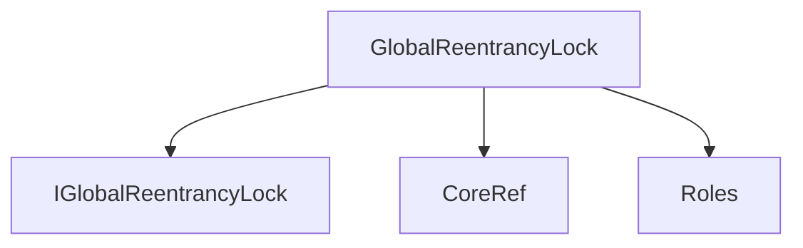
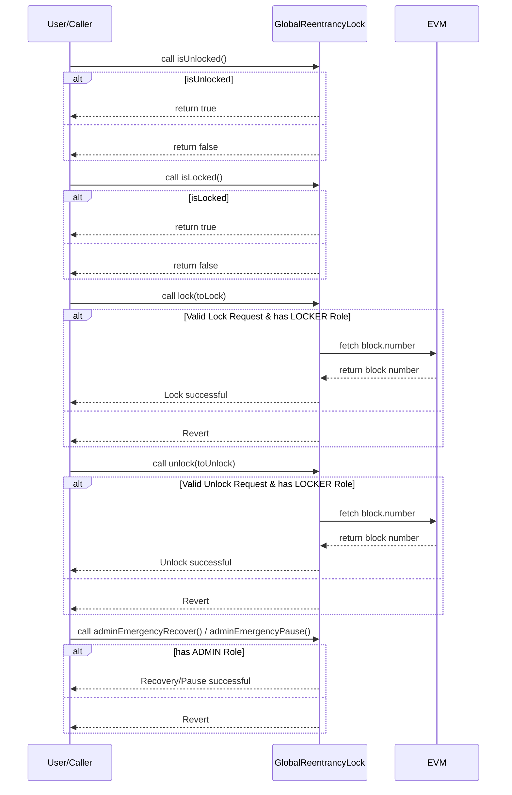

# GlobalReentrancyLock.sol

## Introduction
Designed to mitigate reentrancy attacks. Reentrancy attacks occur when external contract calls are made within a function, potentially allowing malicious actors to reenter the same function and exploit it. This can lead to significant vulnerabilities, particularly in financial contracts where an attacker could drain funds.

### Overview
The diagrams below provide a visual representation of how `GlobalReentrancyLock.sol` interacts with its various features and dependencies. It primarily shows the flow of actions a user can initiate and how the contract interacts with other referenced contracts and utilities.

#### Top-down

#### Sequence

## Base Contracts
### Protocol Specific
- [Roles](https://github.com/ZTX-Foundation/tuxedo/blob/develop/src/core/Roles.sol): Defines the various roles utilized within the system.
- [CoreRef](https://github.com/ZTX-Foundation/tuxedo/blob/develop/src/refs/CoreRef.sol): Provides a reference to the protocol's core contract.
- [IGlobalReentrancyLock](https://github.com/ZTX-Foundation/tuxedo/blob/develop/src/core/IGlobalReentrancyLock.sol): An interface for `GlobalReentrancyLock`.

## Features
- Locking and unlocking must occur in the same block to prevent unknown state changes.
- Only accounts with the `LOCKER` role can lock or unlock the system.
- The system restricts lock progression to ensure a consistent state, e.g., you cannot lock to level 2 directly from an unlocked state.
- The contract offers an emergency recovery mechanism. If the system remains locked beyond the current block, the `ADMIN` role can reset the lock, potentially saving the system from being locked indefinitely.
- There's also a mechanism for the `ADMIN` to pause the entire system by setting the lock to level two.
- Can easily query the current state of the lock.

## Constants
- `_NOT_ENTERED`: The initial state of the lock.
- `_ENTERED_LEVEL_TWO`: The state of the lock after the first lock.

## Constructor
The constructor accepts a single argument:

- `_core`: The address of the core contract that provides roles and access control.
