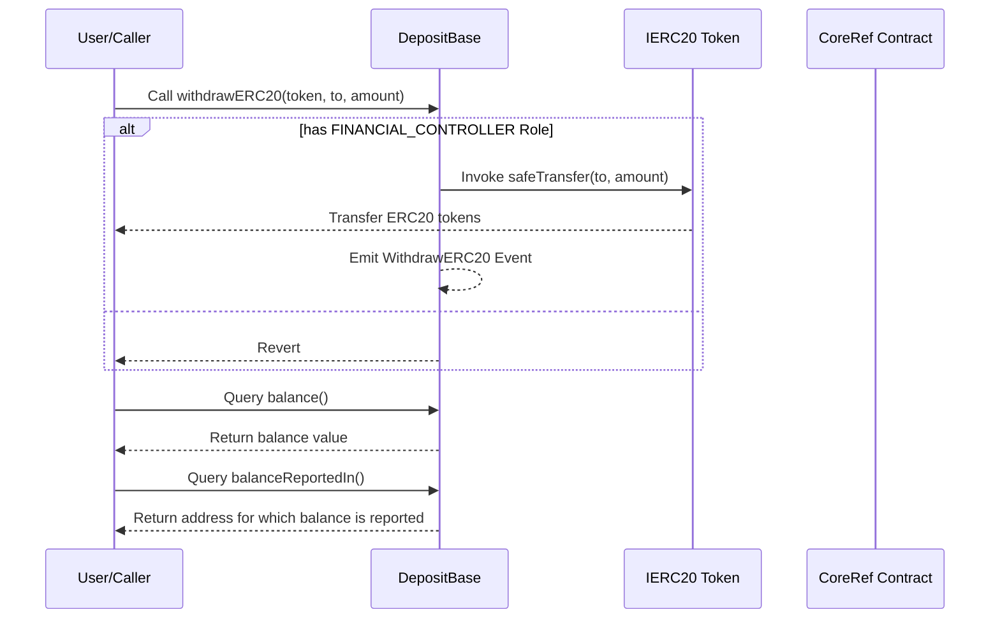

# DepositBase.sol

## Introduction
A foundation for creating specialized deposit contracts within the broader ZTX ecosystem. Designed to facilitate secure interactions with ERC-20 tokens, it encapsulates core functionalities such as withdrawing ERC-20 tokens while integrating permission checks using the financial controller role.

### Overview
The diagrams below provide a visual representation of how `DepositBase.sol` interacts with its various features and dependencies. It primarily shows the flow of actions a user can initiate and how the contract interacts with other referenced contracts and utilities.

#### Top-down

#### Sequence

## Base Contracts
### OpenZeppelin
- [SafeERC20](https://github.com/OpenZeppelin/openzeppelin-contracts/blob/master/contracts/token/ERC20/utils/SafeERC20.sol): Adds safeguards to the standard ERC20 transfer and approve functions.
- [IERC20](https://github.com/OpenZeppelin/openzeppelin-contracts/blob/master/contracts/token/ERC20/IERC20.sol): Interface for the ERC20 standard.
- [Address](https://github.com/OpenZeppelin/openzeppelin-contracts/blob/master/contracts/utils/Address.sol):  A utility library that provides methods to determine if a given address is a contract and to safely send Ether, ensuring the called contract contains no code.
### Protocol Specific
- [Roles](https://github.com/ZTX-Foundation/tuxedo/blob/develop/src/core/Roles.sol): Defines the various roles utilized within the system.
- [CoreRef](https://github.com/ZTX-Foundation/tuxedo/blob/develop/src/refs/CoreRef.sol): Provides a reference to the protocol's core contract.
- [IDepositBase](https://github.com/ZTX-Foundation/tuxedo/blob/develop/src/finance/IDepositBase.sol): An interface that specifies the methods any deposit-based contract should implement.
