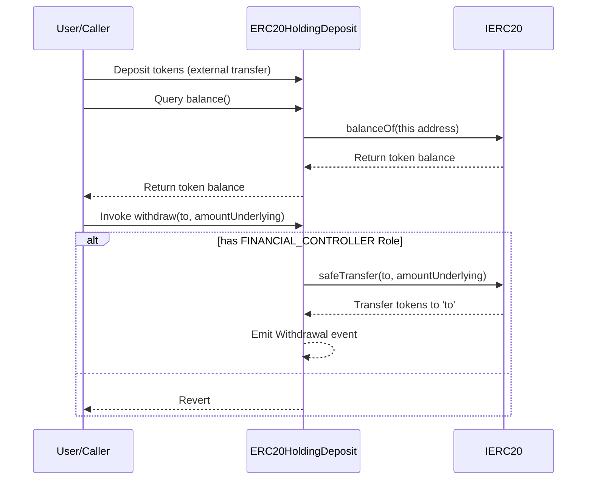

# ERC20HoldingDeposit.sol

## Introduction
This contract serves as a financial safeguard, designed specifically for securely holding ERC20 tokens. The contract strictly ensures that operations, such as withdrawals, are executed only by addresses with the designated `FINANCIAL_CONTROLLER` role, offering an additional layer of security. The contract is also equipped with pause functionality, ensuring administrators have the flexibility to halt activities during unexpected scenarios or emergencies

### Overview
The diagrams below provide a visual representation of how `ERC20HoldingDeposit.sol` interacts with its various features and dependencies. It primarily shows the flow of actions a user can initiate and how the contract interacts with other referenced contracts and utilities.

#### Top-down

#### Sequence

## Base Contracts
### OpenZeppelin
- [SafeERC20](https://github.com/OpenZeppelin/openzeppelin-contracts/blob/master/contracts/token/ERC20/utils/SafeERC20.sol): Adds safeguards to the standard ERC20 transfer and approve functions.
- [IERC20](https://github.com/OpenZeppelin/openzeppelin-contracts/blob/master/contracts/token/ERC20/IERC20.sol): Interface for the ERC20 standard.
### Protocol Specific
- [Roles](https://github.com/ZTX-Foundation/tuxedo/blob/develop/src/core/Roles.sol): Defines the various roles utilized within the system.
- [CoreRef](https://github.com/ZTX-Foundation/tuxedo/blob/develop/src/refs/CoreRef.sol): Provides a reference to the protocol's core contract.
- [Constants](https://github.com/ZTX-Foundation/tuxedo/blob/develop/src/Constants.sol): Protocol constants.
- [DepositBase](https://github.com/ZTX-Foundation/tuxedo/blob/develop/src/finance/DepositBase.sol): Abstract contract for withdrawing ERC-20 tokens using a Financial Controller.
