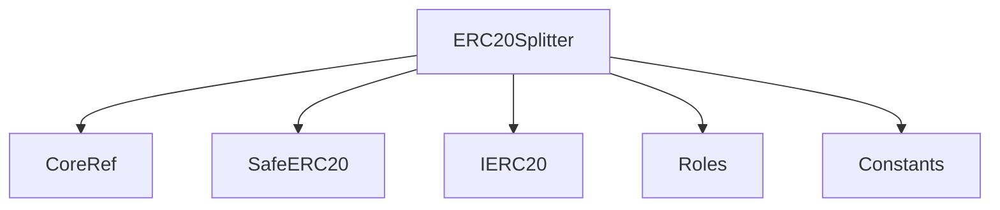
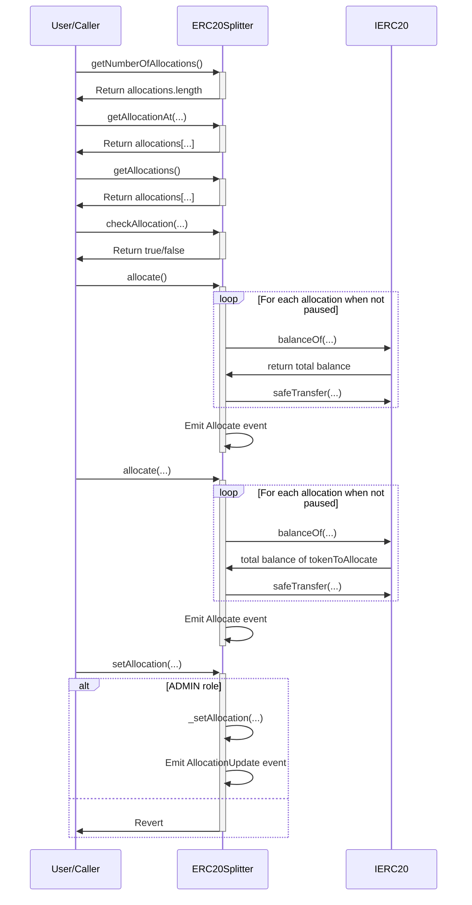

# ERC20Splitter.md

## Introduction
Designed to streamline and automate the process of splitting ERC20 tokens among multiple deposit addresses. The integration with the `CoreRef` contract ensures role-based access controls, ensuring that administrative tasks, like setting allocation ratios and addresses, are restricted to authorized users.

### Overview
The diagrams below provide a visual representation of how `ERC20Splitter.sol` interacts with its various features and dependencies. It primarily shows the flow of actions a user can initiate and how the contract interacts with other referenced contracts and utilities.

#### Top-down

#### Sequence

## Base Contracts
### OpenZeppelin
- [SafeERC20](https://github.com/OpenZeppelin/openzeppelin-contracts/blob/master/contracts/token/ERC20/utils/SafeERC20.sol): Adds safeguards to the standard ERC20 transfer and approve functions.
- [IERC20](https://github.com/OpenZeppelin/openzeppelin-contracts/blob/master/contracts/token/ERC20/IERC20.sol): Interface for the ERC20 standard.
### Protocol Specific
- [Roles](https://github.com/ZTX-Foundation/tuxedo/blob/develop/src/core/Roles.sol): Defines the various roles utilized within the system.
- [CoreRef](https://github.com/ZTX-Foundation/tuxedo/blob/develop/src/refs/CoreRef.sol): Provides a reference to the protocol's core contract.
- [Constants](https://github.com/ZTX-Foundation/tuxedo/blob/develop/src/Constants.sol): Protocol constants.

## Structs
### `Allocation`
Defines the allocation ratio and deposit address for a given token.
- `deposit`: The deposit address to allocate tokens to.
- `ratio`: The ratio of the total balance to allocate to the deposit address.

## Events
These events offer a mechanism to track and audit the various interactions and updates that occur within the `ERC20Splitter` contract.

### `Allocate`
Emitted when funds are allocated to deposits.
Logs:
- `caller`: Address of the caller.
- `amount`: Amount of tokens allocated.

## Constructor
The constructor accepts three arguments:

- `_core`: The address of the core contract that provides roles and access control.
- `_token`: The address of the token to split.
- `_deposits`: An array of deposit addresses to allocate tokens to.

## Functions
### `getNumberOfAllocations()`
Returns the number of allocations defined in the splitter contract.

### `getAllocationAt()`
Returns the allocation details (deposit address and ratio) at the specified index in the allocations array.

### `getAllocations()`
Returns an array of all allocations defined in the splitter contract, including deposit addresses and their allocation ratios.

### `checkAllocation()`
Checks whether the allocation ratios in the provided list of deposits total 100% (`Constants.BASIS_POINTS_GRANULARITY`). This function is a pure function and does not modify the contract state.

### `allocate()`
Allocates all funds in the splitter contract to the defined deposits based on their allocation ratios. This function transfers the ERC-20 tokens to each deposit accordingly.

### `allocate()`
Allocates all funds in the splitter contract to the defined deposits based on their allocation ratios for a specified ERC-20 token (tokenToAllocate). This function transfers tokens to each deposit accordingly.

### `setAllocation()`
Allows `ADMIN` to set the allocation of deposits. It replaces the existing allocation with the new one provided.

### `_setAllocation()`
Sets a new allocation for the splitter contract. This internal function is used to update the allocation.
