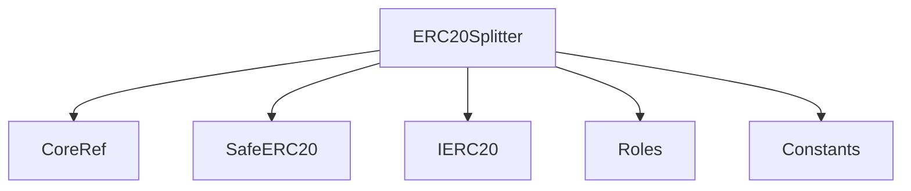
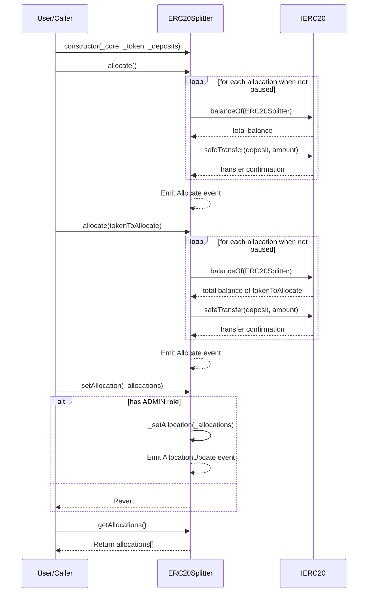

# ERC20Splitter.md

## Introduction
Designed to streamline and automate the process of splitting ERC20 tokens among multiple deposit addresses. The integration with the `CoreRef` contract ensures role-based access controls, ensuring that administrative tasks, like setting allocation ratios and addresses, are restricted to authorized users.

### Overview
The diagrams below provide a visual representation of how `ERC20Splitter.sol` interacts with its various features and dependencies. It primarily shows the flow of actions a user can initiate and how the contract interacts with other referenced contracts and utilities.

#### Top-down

#### Sequence

## Base Contracts
### OpenZeppelin
- [SafeERC20](https://github.com/OpenZeppelin/openzeppelin-contracts/blob/master/contracts/token/ERC20/utils/SafeERC20.sol): Adds safeguards to the standard ERC20 transfer and approve functions.
- [IERC20](https://github.com/OpenZeppelin/openzeppelin-contracts/blob/master/contracts/token/ERC20/IERC20.sol): Interface for the ERC20 standard.
### Protocol Specific
- [Roles](https://github.com/ZTX-Foundation/tuxedo/blob/develop/src/core/Roles.sol): Defines the various roles utilized within the system.
- [CoreRef](https://github.com/ZTX-Foundation/tuxedo/blob/develop/src/refs/CoreRef.sol): Provides a reference to the protocol's core contract.
- [Constants](https://github.com/ZTX-Foundation/tuxedo/blob/develop/src/Constants.sol): Protocol constants.
