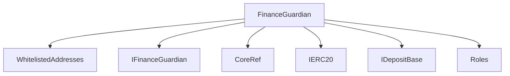
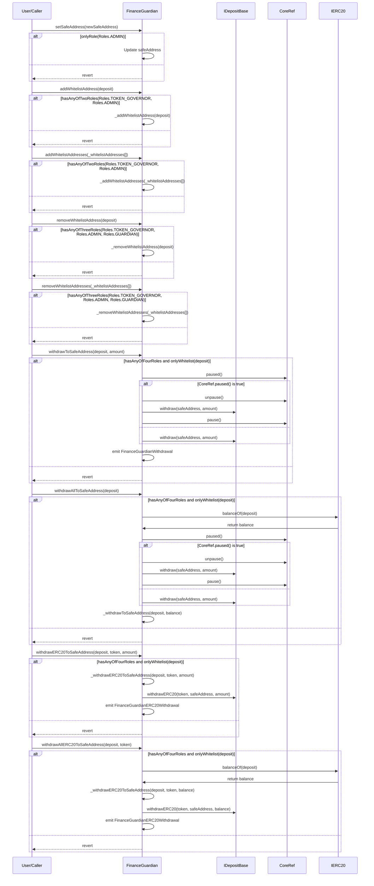

# FinanceGuardian.sol

## Introduction
This serves as a protective mechanism within the protocol, designed explicitly to safeguard protocol funds. By allowing only specific, whitelisted deposit addresses, it offers a controlled environment for funds withdrawal to a designated safe address. Integrated with role-based access control, the contract ensures that only authorized entities, like administrators, token governors, or guardians, can execute crucial functions. This includes updating the safe address, adding or removing addresses from the whitelist, and withdrawing funds or ERC20 tokens.

### Overview
The diagrams below provide a visual representation of how `FinanceGuardian.sol` interacts with its various features and dependencies. It primarily shows the flow of actions a user can initiate and how the contract interacts with other referenced contracts and utilities.

#### Top-down

#### Sequence

## Base Contracts
### OpenZeppelin
- [IERC20](https://github.com/OpenZeppelin/openzeppelin-contracts/blob/master/contracts/token/ERC20/IERC20.sol): Interface for the ERC20 standard.
### Protocol Specific
- [CoreRef](https://github.com/ZTX-Foundation/tuxedo/blob/develop/src/refs/CoreRef.sol): Provides a reference to the protocol's core contract.
- [Roles](https://github.com/ZTX-Foundation/tuxedo/blob/develop/src/core/Roles.sol): Defines the various roles utilized within the system.
- [IDepositBase](https://github.com/ZTX-Foundation/tuxedo/blob/develop/src/finance/IDepositBase.sol): An interface that outlines the functions for deposit-related operations.
- [IFinanceGuardian](https://github.com/ZTX-Foundation/tuxedo/blob/develop/src/finance/IFinanceGuardian.sol): The primary interface which dictates the expected structure and functions the `FinanceGuardian` should implement.

## Features
- An `address` state variable, `safeAddress`, holds the designated safe destination to which funds can be withdrawn.
- Ensures the provided safe address is not the zero address.
- `withdrawToSafeAddress()` allows authorized roles to withdraw a specified amount from a whitelisted deposit to the safe address.
- `withdrawAllToSafeAddress()` withdraws the entire balance from a specified whitelisted deposit to the safe address.
- If the deposit source is paused, the function temporarily unpauses it, performs the withdrawal, and then pauses it again.
- Flexibility to either specify an amount or withdraw the entire balance of the token from the deposit.

## Constructor
The constructor accepts three arguments:

- `_core`: The address of the core contract that provides roles and access control.
- `_safeAddress`: The address where funds can be withdrawn to.
- `_whitelistAddresses`: An array of addresses that are initially whitelisted for fund withdrawals.

## Functions
### `setSafeAddress()`
Allows `ADMIN` to change the safe withdrawal address.

### `addWhitelistAddress()`
Allows `ADMIN` or `TOKEN_GOVERNOR` to whitelist a deposit address for fund withdrawal.

### `addWhitelistAddresses()`
Allows `ADMIN` or `TOKEN_GOVERNOR` to whitelist multiple deposit addresses for fund withdrawal.

### `removeWhitelistAddress()`
Allows `ADMIN`, `TOKEN_GOVERNOR` or `GUARDIAN` to remove a deposit address from the whitelist.

### `removeWhitelistAddresses()`
Allows `ADMIN`, `TOKEN_GOVERNOR` or `GUARDIAN` to remove multiple deposit addresses from the whitelist.

### `withdrawToSafeAddress()`
Allows `ADMIN`, `TOKEN_GOVERNOR`, `GUARDIAN` or `FINANCIAL_GUARDIAN` to withdraw funds from a whitelisted deposit address to the safe withdrawal address.

### `withdrawAllToSafeAddress()`
Allows `ADMIN`, `TOKEN_GOVERNOR`, `GUARDIAN` or `FINANCIAL_GUARDIAN` to withdraw all funds from a whitelisted deposit address to the safe withdrawal address.

### `withdrawERC20ToSafeAddress()`
Allows `ADMIN`, `TOKEN_GOVERNOR`, `GUARDIAN` or `FINANCIAL_GUARDIAN` to withdraw ERC-20 tokens from a whitelisted deposit address to the safe withdrawal address.

### `withdrawAllERC20ToSafeAddress()`
Allows `ADMIN`, `TOKEN_GOVERNOR`, `GUARDIAN` or `FINANCIAL_GUARDIAN` to withdraw all ERC-20 tokens from a whitelisted deposit address to the safe withdrawal address.
