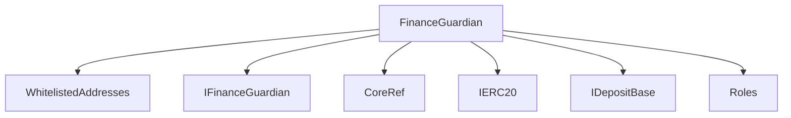
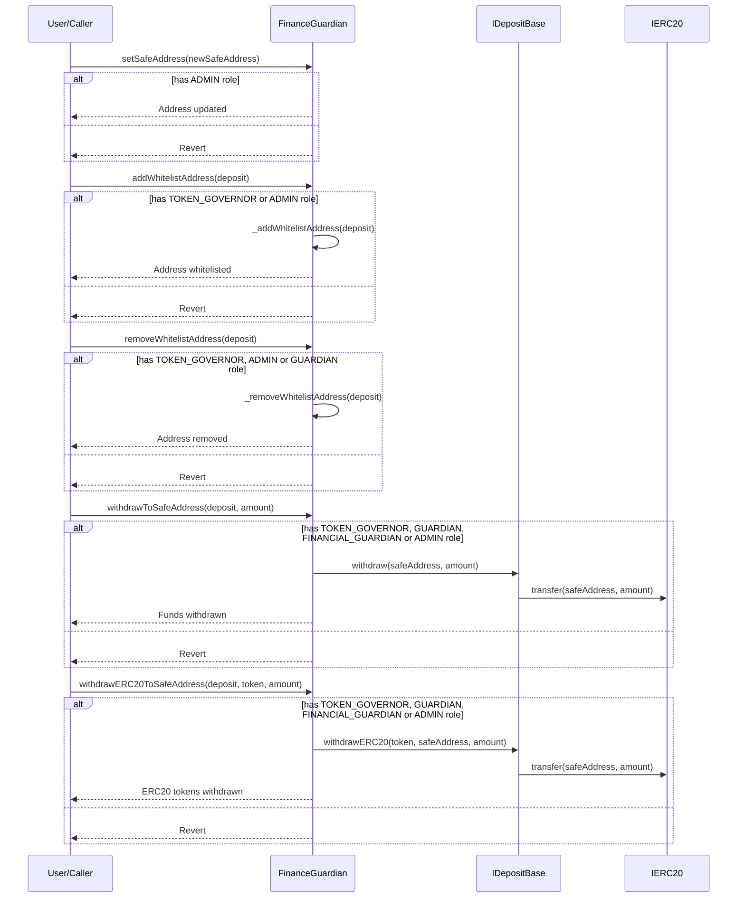

# FinanceGuardian.sol

## Introduction
This serves as a protective mechanism within the protocol, designed explicitly to safeguard protocol funds. By allowing only specific, whitelisted deposit addresses, it offers a controlled environment for funds withdrawal to a designated safe address. Integrated with role-based access control, the contract ensures that only authorized entities, like administrators, token governors, or guardians, can execute crucial functions. This includes updating the safe address, adding or removing addresses from the whitelist, and withdrawing funds or ERC20 tokens.

### Overview
The diagrams below provide a visual representation of how `FinanceGuardian.sol` interacts with its various features and dependencies. It primarily shows the flow of actions a user can initiate and how the contract interacts with other referenced contracts and utilities.

#### Top-down

#### Sequence

## Base Contracts
### OpenZeppelin
- [IERC20](https://github.com/OpenZeppelin/openzeppelin-contracts/blob/master/contracts/token/ERC20/IERC20.sol): Interface for the ERC20 standard.
### Protocol Specific
- [CoreRef](https://github.com/ZTX-Foundation/tuxedo/blob/develop/src/refs/CoreRef.sol): Provides a reference to the protocol's core contract.
- [Roles](https://github.com/ZTX-Foundation/tuxedo/blob/develop/src/core/Roles.sol): Defines the various roles utilized within the system.
- [IDepositBase](https://github.com/ZTX-Foundation/tuxedo/blob/develop/src/finance/IDepositBase.sol): An interface that outlines the functions for deposit-related operations.
- [IFinanceGuardian](https://github.com/ZTX-Foundation/tuxedo/blob/develop/src/finance/IFinanceGuardian.sol): The primary interface which dictates the expected structure and functions the `FinanceGuardian` should implement.
