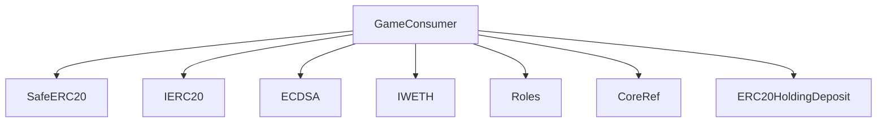
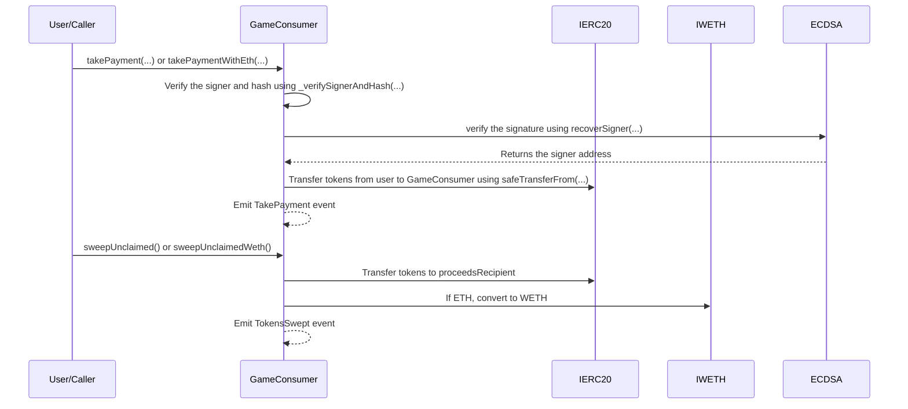

# GameConsumer.sol

## Introduction
This contract facilitates game-related payments and operations. It stands as a bridge between blockchain utilities and gaming functionalities, enabling players to enhance their gameplay experience.

### Overview
The diagrams below provide a visual representation of how `GameConsumer.sol` interacts with its various features and dependencies. It primarily shows the flow of actions a user can initiate and how the contract interacts with other referenced contracts and utilities.

#### Top-down

#### Sequence

## Base Contracts
### OpenZeppelin
- [SafeERC20](https://github.com/OpenZeppelin/openzeppelin-contracts/blob/master/contracts/token/ERC20/utils/SafeERC20.sol): Adds safeguards to the standard ERC20 transfer and approve functions.
- [IERC20](https://github.com/OpenZeppelin/openzeppelin-contracts/blob/master/contracts/token/ERC20/IERC20.sol): Interface for the ERC20 standard.
- [ECDSA](https://github.com/OpenZeppelin/openzeppelin-contracts/blob/master/contracts/utils/cryptography/ECDSA.sol): Provides functions related to the Elliptic Curve Digital Signature Algorithm (ECDSA). It's mainly used to handle signatures in Ethereum transactions.
### Protocol Specific
- [IWETH](https://github.com/ZTX-Foundation/tuxedo/blob/develop/src/interface/IWETH.sol): Interface for Wrapped Ethereum.
- [Roles](https://github.com/ZTX-Foundation/tuxedo/blob/develop/src/core/Roles.sol): Defines the various roles utilized within the system.
- [CoreRef](https://github.com/ZTX-Foundation/tuxedo/blob/develop/src/refs/CoreRef.sol): Provides a reference to the protocol's core contract.
- [ERC20HoldingDeposit](https://github.com/ZTX-Foundation/tuxedo/blob/develop/src/finance/ERC20HoldingDeposit.sol): Hold and manage deposits of ERC20 tokens.
- [WhitelistedAddresses](https://github.com/ZTX-Foundation/tuxedo/blob/develop/src/utils/extensions/WhitelistedAddresses.sol): Manages a list of approved addresses that are permitted to interact with specific functionalities of the contract.

## Features
- Maintains a reference to a WETH token through `weth`.
- Tracks used hashes to prevent replays with `usedHashes`.
- Has a `proceedsRecipient` address which is the destination for unclaimed funds.
- A signature is required to verify the authenticity of the payment, ensuring it matches the expected details (jobId, paymentToken, jobFee, etc.).
- Offers `wrapEth()` to convert any native ETH in the contract to WETH.
- Allows unclaimed tokens and WETH to be swept to the `proceedsRecipient` through `sweepUnclaimed()` and `sweepUnclaimedWeth()`.

## Events
These events offer a mechanism to track and audit the various interactions and updates that occur within the `GameConsumer` contract.

### `TakePayment`
Emitted when in payment is taken.
Logs:
- `jobId`: The backend job ID.
- `amount`: Payment amount.

### `WithdrawToCollector`
Emitted when proceeds are withdrawn.
Logs:
- `proceedsCollector`: The address of where the proceeds were withdrawn to.
- `amount`: The amount of proceeds withdrawn.

### `ProceedsRecipientUpdated`
Emitted when proceeds collector is updated.
Logs:
- `proceedsCollector`: The new address of where the proceeds collector.

### `TokensSwept`
Emitted when tokens are swept.
Logs:
- `token`: The address of the token that was swept.
- `proceedsCollector`: The address of where the proceeds were withdrawn to.
- `amount`: The amount of tokens swept.

## Constructor
The constructor accepts four arguments:

- `_core`: The address of the core contract that provides roles and access control.
- `_token`: The address of the ZTX token contract.
- `_proceedsRecipient`: The address where all proceeds will be sent.
- `_weth`: The address of the Wrapped Ether (WETH) token.

## Functions
### `_verifySignerAndHash()`
Verifies the signer and hash of a crafted message and checks for various conditions, including the timestamp, used hashes, and role permissions.

### `takePayment()`
Allows users to make a payment in a specified token for a given off-chain job. It verifies the signer and hash, transfers the payment token, and emits a `TakePayment` event.

### `takePaymentWithEth()`
Allows users to make a payment in Ether for a given off-chain job. It verifies the signer and hash, checks the ETH value sent, and emits a `TakePayment` event.

### `getHash()`
Computes and returns a hash based on various parameters, which is used for message verification.

### `recoverSigner()`
Returns the address that signed a given message hash.

### `setProceedsCollector()`
Allows the admin to set the proceeds recipient address and emits a `ProceedsRecipientUpdated` event.

### `wrapEth()`
Converts raw Ether into wrapped Ether (WETH).

### `sweepUnclaimed()`
Withdraws unclaimed tokens to the proceeds recipient address and emits a TokensSwept event.

### `sweepUnclaimedWeth()`
Withdraws unclaimed WETH tokens to the proceeds recipient address and emits a TokensSwept event.
