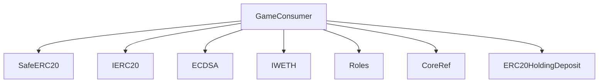
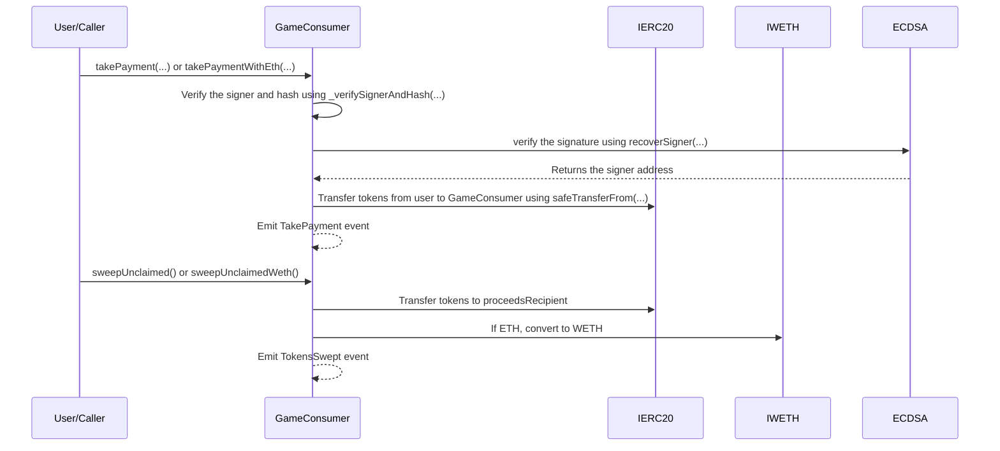

# GameConsumer.sol

## Introduction
This contract facilitates game-related payments and operations. It stands as a bridge between blockchain utilities and gaming functionalities, enabling players to enhance their gameplay experience.

### Overview
The diagrams below provide a visual representation of how `GameConsumer.sol` interacts with its various features and dependencies. It primarily shows the flow of actions a user can initiate and how the contract interacts with other referenced contracts and utilities.

#### Top-down

#### Sequence

## Base Contracts
### OpenZeppelin
- [SafeERC20](https://github.com/OpenZeppelin/openzeppelin-contracts/blob/master/contracts/token/ERC20/utils/SafeERC20.sol): Adds safeguards to the standard ERC20 transfer and approve functions.
- [IERC20](https://github.com/OpenZeppelin/openzeppelin-contracts/blob/master/contracts/token/ERC20/IERC20.sol): Interface for the ERC20 standard.
- [ECDSA](https://github.com/OpenZeppelin/openzeppelin-contracts/blob/master/contracts/utils/cryptography/ECDSA.sol): Provides functions related to the Elliptic Curve Digital Signature Algorithm (ECDSA). It's mainly used to handle signatures in Ethereum transactions.
### Protocol Specific
- [IWETH](https://github.com/ZTX-Foundation/tuxedo/blob/develop/src/interface/IWETH.sol): Interface for Wrapped Ethereum.
- [Roles](https://github.com/ZTX-Foundation/tuxedo/blob/develop/src/core/Roles.sol): Defines the various roles utilized within the system.
- [CoreRef](https://github.com/ZTX-Foundation/tuxedo/blob/develop/src/refs/CoreRef.sol): Provides a reference to the protocol's core contract.
- [ERC20HoldingDeposit](https://github.com/ZTX-Foundation/tuxedo/blob/develop/src/finance/ERC20HoldingDeposit.sol): Hold and manage deposits of ERC20 tokens.
- [WhitelistedAddreses](https://github.com/ZTX-Foundation/tuxedo/blob/develop/src/utils/extensions/WhitelistedAddreses.sol): Manages a list of approved addresses that are permitted to interact with specific functionalities of the contract.

## Features
- Maintains a reference to a WETH token through `weth`.
- Tracks used hashes to prevent replays with `usedHashes`.
- Has a `proceedsRecipient` address which is the destination for unclaimed funds.
- A signature is required to verify the authenticity of the payment, ensuring it matches the expected details (jobId, paymentToken, jobFee, etc.).
- Offers `wrapEth()` to convert any native ETH in the contract to WETH.
- Allows unclaimed tokens and WETH to be swept to the `proceedsRecipient` through `sweepUnclaimed()` and `sweepUnclaimedWeth()`.
