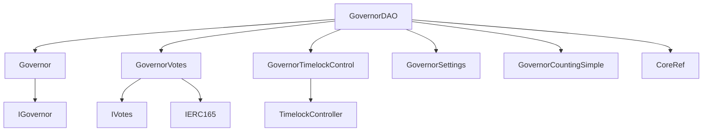
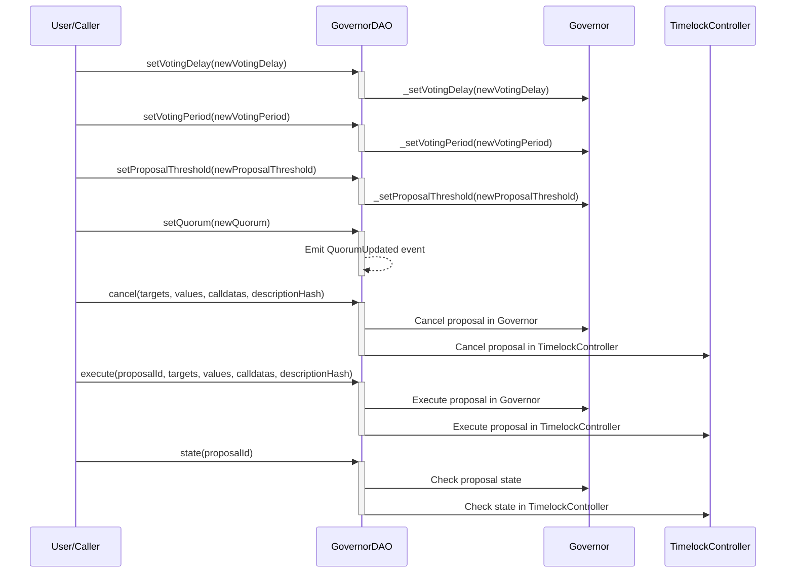

# GovernorDAO.md

## Introduction
This contract serves as a governance mechanism tailored for ZTX. It also provides a comprehensive governance solution that ensures protocol decisions are made transparently, democratically, and securely, aligning with the principles of decentralized systems.

### Overview
The diagrams below provide a visual representation of how `GovernorDAO.sol` interacts with its various features and dependencies. It primarily shows the flow of actions a user can initiate and how the contract interacts with other referenced contracts and utilities.

#### Top-down

#### Sequence

## Base Contracts
### OpenZeppelin
- [Governor](): This is the main governance contract provided by OpenZeppelin. It handles the core logic for creating, casting votes on, and executing proposals.
- [GovernorVotes](): This extension handles the voting weight of governance participants. It interacts with an external contract that implements the `IVotes` interface to obtain the voting power of an account.
- [GovernorTimelockControl](): This extension adds a timelock mechanism to the governance process. Proposals, once approved, are queued in a timelock, and can only be executed after a certain duration has passed.
- [GovernorSettings](): This extension provides settings for the governance process. It allows the setting of parameters such as the voting delay, voting period, and proposal threshold. These parameters can be modified by the appropriate role or authority.
- [GovernorCountingSimple](): This is a vote-counting strategy. It implements a straightforward majority mechanism, where a proposal is approved if it receives more votes in favor than against.
- [TimelockController](): A central component for the time-lock mechanism. It manages the queuing, scheduling, and execution of delayed transactions. The `GovernorTimelockControl` interacts with this to impose delays on proposal execution.
### Protocol Specific
- [Roles](https://github.com/ZTX-Foundation/tuxedo/blob/develop/src/core/Roles.sol): Manages different roles for access control.
- [CoreRef](https://github.com/ZTX-Foundation/tuxedo/blob/develop/src/refs/CoreRef.sol): Provides a reference to the protocol's core contract.

## Features
- Manages the creation, execution, and cancellation of governance proposals.
- Maintains a `_quorum` private state variable to track the minimum number of votes required for a proposal to pass.
- The constructor initializes the contract with a governance token, timelock address, and governance settings (voting delay, voting period, proposal threshold, and initial quorum).
- Allows adjustment of voting settings (voting delay, voting period, and proposal threshold) with associated functions (`setVotingDelay()`, `setVotingPeriod()`, and `setProposalThreshold()`).
- Provides a cancel function for the guardian (defined by the `GUARDIAN` role) to cancel a proposal in progress.

## Events
These events offer a mechanism to track and audit the various interactions and updates that occur within the `GovernorDAO` contract.

### `QuorumUpdated`
Emitted when quorum is updated.
Logs:
- `oldQuorum`: The old quorum value.
- `newQuorum`: The new quorum value.

## Constructor
The constructor accepts eight arguments:

- `name`: A string representing the name of the Governor contract.
- `_core`: The address of the core contract that provides roles and access control.
- `_timelock`: The address of the Timelock contract.
- `_token`: The address of the ZTX token contract.
- `initialVotingDelay`: An initial voting delay value in blocks.
- `initialVotingPeriod`: An initial voting period value in blocks.
- `initialProposalThreshold`: An initial proposal threshold value.
- `initialQuorum`: An initial quorum value.

The constructor ensures that the initial quorum value is greater than zero.

## Functions
### `quorum()`
Returns the current quorum required for a proposal to pass.

### `_setQuorum()`
Sets the quorum to a new value and emits a `QuorumUpdated` event.

### `setVotingDelay()`
Allows changing the voting delay, rrestricted to `TOKEN_GOVERNOR`.

### `setVotingPeriod()`
Allows changing the voting period, restricted to `TOKEN_GOVERNOR`.

### `setProposalThreshold()`
Allows changing the proposal threshold, restricted to `TOKEN_GOVERNOR`.

### `setQuorum()`
Allows changing the quorum, restricted to `TOKEN_GOVERNOR`.

### `cancel()`
Allows `GUARDIAN` to cancel a proposal in progress by providing proposal details.

### `_cancel()`
Internal function to cancel a proposal.

### `_execute()`
Internal function to execute a proposal.

### `_executor()`
Internal function to get the executor address.

### `proposalThreshold()`
Returns the current proposal threshold.

### `state()`
Returns the current state of a proposal.

### `supportsInterface()`:
Checks if an interface is supported by the contract.
