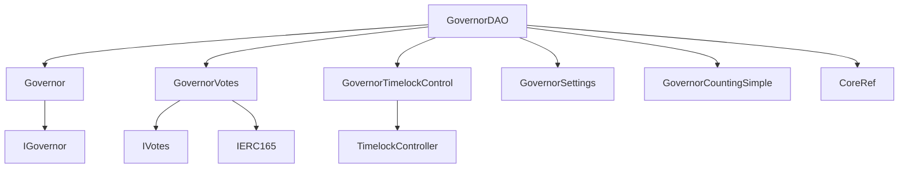
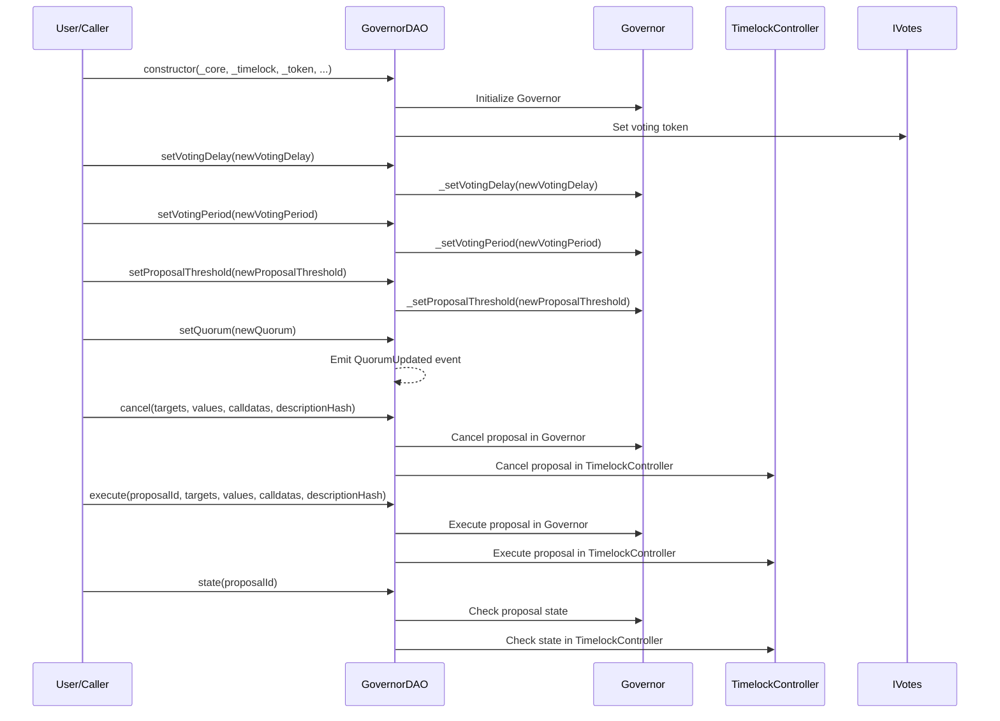

# GovernorDAO.md

## Introduction
This contract serves as a governance mechanism tailored for ZTX. It also provides a comprehensive governance solution that ensures protocol decisions are made transparently, democratically, and securely, aligning with the principles of decentralized systems.

### Overview
The diagrams below provide a visual representation of how `GovernorDAO.sol` interacts with its various features and dependencies. It primarily shows the flow of actions a user can initiate and how the contract interacts with other referenced contracts and utilities.

#### Top-down

#### Sequence

## Base Contracts
### OpenZeppelin
- [Governor](): This is the main governance contract provided by OpenZeppelin. It handles the core logic for creating, casting votes on, and executing proposals.
- [GovernorVotes](): This extension handles the voting weight of governance participants. It interacts with an external contract that implements the `IVotes` interface to obtain the voting power of an account.
- [GovernorTimelockControl](): This extension adds a timelock mechanism to the governance process. Proposals, once approved, are queued in a timelock, and can only be executed after a certain duration has passed.
- [GovernorSettings](): This extension provides settings for the governance process. It allows the setting of parameters such as the voting delay, voting period, and proposal threshold. These parameters can be modified by the appropriate role or authority.
- [GovernorCountingSimple](): This is a vote-counting strategy. It implements a straightforward majority mechanism, where a proposal is approved if it receives more votes in favor than against.
- [TimelockController](): A central component for the time-lock mechanism. It manages the queuing, scheduling, and execution of delayed transactions. The `GovernorTimelockControl` interacts with this to impose delays on proposal execution.
### Protocol Specific
- [Roles](https://github.com/ZTX-Foundation/tuxedo/blob/develop/src/core/Roles.sol): Manages different roles for access control.
- [CoreRef](https://github.com/ZTX-Foundation/tuxedo/blob/develop/src/refs/CoreRef.sol): Provides a reference to the protocol's core contract.
