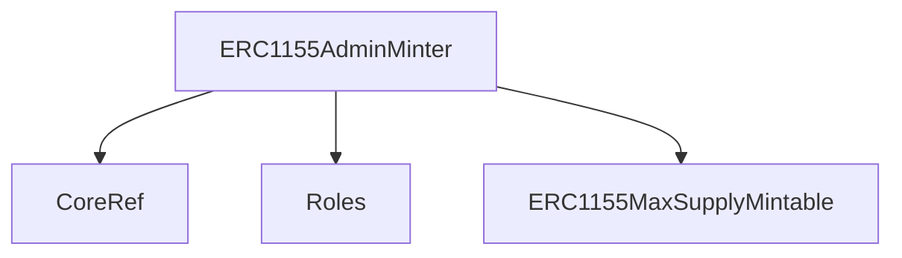
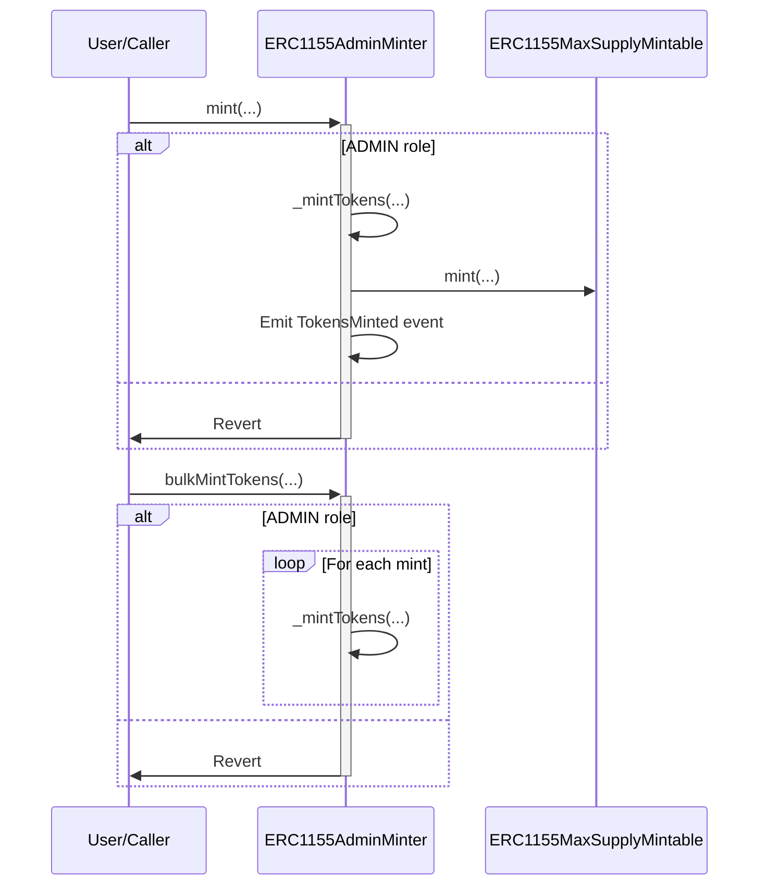

# ERC1155AdminMinter.sol

## Introduction
The primary purpose of `ERC1155AdminMinter` is to facilitate the minting of ERC-1155 tokens, as `ADMIN`.

### Overview
The diagram below provides a visual representation of how `ERC1155AdminMinter.sol` interacts with its various features and dependencies. It primarily shows the flow of actions a user can initiate and how the contract interacts with other referenced contracts and utilities.

#### Top-down

#### Sequence

## Base Contracts
### Protocol Specific
- [CoreRef](https://github.com/ZTX-Foundation/tuxedo/blob/develop/src/refs/CoreRef.sol): Provides a reference to the protocol's core contract.
- [Roles](https://github.com/ZTX-Foundation/tuxedo/blob/develop/src/core/Roles.sol): Manages different roles for access control.
- [ERC1155MaxSupplyMintable](https://github.com/ZTX-Foundation/tuxedo/blob/develop/src/nfts/ERC1155MaxSupplyMintable.sol): An extension of the standard ERC-1155 to support minting with a maximum supply.

## Structs
### BulkMint
Contains the parameters for bulk minting NFTs.
- `nftContract`: The address of the ERC-1155 contract to mint from.
- `tokenId`: The ID of the NFT to mint.
- `amount`: The amount of NFTs to mint.
- `recipient`: The address of the recipient of the minted NFTs.

## Events
These events offer a mechanism to track and audit the various interactions and updates that occur within the `ERC1155AdminMinter` contract.

### `TokensMinted`
Emitted when tokens are minted.
Logs:
- `nftContract`: The address of the contract that was added to the whitelist.
- `recipient`: The address of the recipient of the minted tokens.
- `tokenId`: The ID of the token that was minted.
- `amount`: The amount of tokens that were minted.

## Constructor
The constructor accepts a single argument:

- `_core`: The address of the core contract that provides roles and access control.

## Functions
### `mintToken()`
Mints a single token to a recipient.

### `bulkMintTokens()`
Mints multiple tokens to multiple recipients.

### `_mintTokens()`
Helper function that mints tokens and emits an event for each token minted.

## Usage
First, ensure the supply cap is set for the tokenId being minted. Do this by calling the `setSupplyCap(uint256 tokenId, uint256 maxSupply)` function on the ERC1155 that is being minted. This will set the supply cap for the token type.

Then, call the `mintToken(address nftContract, address recipient uint256 tokenId, uint256 amount)` function on the `ERC1155AdminMint` contract. This will mint the tokens to the specified recipient, and emit a `TokensMinted` event.

Alternatively, you can call the `bulkMintTokens(BulkMint[] toMint)` function to mint multiple tokens to multiple recipients once.

### Gnosis
To use this in Gnosis, navigate to the apps section of the Gnosis UI. Then search `transaction builder`, click into open Safe App.

If the supply cap has not been set for the asset you would like to mint, you will need to set it. To do this, enter the address of the ERC1155 contract you would like to mint from. Then select the function `setSupplyCap(tokenId,maxSupply)`. Now, enter the parameters with the first being the tokenId you would like to mint and the second being the maximum supply for the given tokenId. Then, click `Add transaction`.

Once the supply cap has been set, you will need to mint tokens. If the supply cap needed to be set, the minting can happen in the same transaction. To do this, enter the ERC1155AdminMinter contract and select the function `mintToken(nftContract,recipient,tokenId,amount)`. Now, enter the parameters with the first being the address of the ERC1155 contract you would like to mint from, the second being the address of the recipient, the third being the tokenId you would like to mint (which should have a non zero supply cap), and the fourth being the amount of tokens you would like to mint. Then, click `Add transaction`.

Now click `Create Batch`, click `Simulate` to ensure the transaction succeeds before submitting it for signing, and then if the simulation is successful, click `Send Batch` to allow other signers to sign the transaction in the Safe. If the simulation is unsuccessful, you will need to edit the parameters and try the simulation again before submitting.
