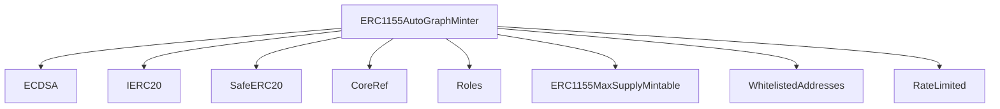

# ERC1155AutoGraphMinter.sol

## Introduction
Its primary purpose is to facilitate the (rate-limited) minting of ERC-1155 tokens.

### Overview
The diagram below provides a visual representation of how `ERC1155AutoGraphMinter.sol` interacts with its various features and dependencies. It primarily shows the flow of actions a user can initiate and how the contract interacts with other referenced contracts and utilities.

#### Top-down

#### Sequence

```mermaid
sequenceDiagram
    participant User as User/Caller
    participant ERC1155AutoGraphMinter
    participant IERC20
    participant ERC1155MaxSupplyMintable
    participant WhitelistedAddresses

    User->>+ERC1155AutoGraphMinter: mintForFree(...)
    alt Valid expiry token
        ERC1155AutoGraphMinter->>ERC1155AutoGraphMinter: _verifyHashAndSignerRoleExpireHashAndDepleteBuffer()
        alt Hash and signature are valid
            ERC1155AutoGraphMinter->>ERC1155MaxSupplyMintable: mint(...)
            ERC1155AutoGraphMinter->>ERC1155AutoGraphMinter: Emit ERC1155Minted event
        else
            ERC1155AutoGraphMinter->>User: Revert
        end
    else
        ERC1155AutoGraphMinter->>-User: Revert
    end

    User->>+ERC1155AutoGraphMinter: mintWithPaymentTokenAsFee(...)
    alt Valid expiry token
        ERC1155AutoGraphMinter->>ERC1155AutoGraphMinter: _mintChecksForPaymentTokenFee(...)
        ERC1155AutoGraphMinter->>ERC1155AutoGraphMinter: _verifyHashAndSignerRoleExpireHashAndDepleteBuffer()
        alt Hash and signature are valid
            ERC1155AutoGraphMinter->>IERC20: safeTransferFrom(...)
            IERC20-->>ERC1155AutoGraphMinter: Transfer successful
            ERC1155AutoGraphMinter->>ERC1155MaxSupplyMintable: mint(...)
            ERC1155AutoGraphMinter->>ERC1155AutoGraphMinter: Emit ERC1155Minted event
        else
            ERC1155AutoGraphMinter->>User: Revert
        end
    else
        ERC1155AutoGraphMinter->>-User: Revert
    end
    
    User->>+ERC1155AutoGraphMinter: mintWithPaymentTokenAsFeeWithParams(...)
    ERC1155AutoGraphMinter->>-ERC1155AutoGraphMinter: mintWithPaymentTokenAsFee(...)

    User->>+ERC1155AutoGraphMinter: mintWithEthAsFee(...)
    alt Valid expiry token and has correct paymentAmount
        ERC1155AutoGraphMinter->>ERC1155AutoGraphMinter: _verifyHashAndSignerRoleExpireHashAndDepleteBuffer()
        alt Hash and Signature are Valid
            ERC1155AutoGraphMinter->>ERC1155AutoGraphMinter: Transfer ETH to paymentRecipient
            ERC1155AutoGraphMinter->>ERC1155MaxSupplyMintable: mint(...)
            ERC1155AutoGraphMinter->>ERC1155AutoGraphMinter: Emit ERC1155Minted event
        else
            ERC1155AutoGraphMinter->>User: Revert
        end
    else
        ERC1155AutoGraphMinter->>-User: Revert
    end

    User->>+ERC1155AutoGraphMinter: mintBatchForFree(...)
    ERC1155AutoGraphMinter->>ERC1155AutoGraphMinter: _mintBatch(...)
    ERC1155AutoGraphMinter->>ERC1155MaxSupplyMintable: mintBatch(...)
    ERC1155AutoGraphMinter-->>-ERC1155AutoGraphMinter: Emit ERC1155BatchMinted event
    
    User->>+ERC1155AutoGraphMinter: mintBatchWithPaymentTokenAsFee(...)
    ERC1155AutoGraphMinter->>ERC1155AutoGraphMinter: _mintBatch(...)
    ERC1155AutoGraphMinter->>IERC20: safeTransferFrom(...)
    IERC20->>ERC1155AutoGraphMinter: Transfer Successful
    ERC1155AutoGraphMinter->>ERC1155MaxSupplyMintable: mintBatch(...)
    ERC1155AutoGraphMinter->>-ERC1155AutoGraphMinter: Emit ERC1155BatchMinted event
    
    User->>+ERC1155AutoGraphMinter: mintBatchWithEthAsFee(...)
    ERC1155AutoGraphMinter->>ERC1155AutoGraphMinter: _mintBatch(...)
    ERC1155AutoGraphMinter->>ERC1155AutoGraphMinter: Transfer ETH to paymentRecipient
    ERC1155AutoGraphMinter->>ERC1155MaxSupplyMintable: mintBatch(...)
    ERC1155AutoGraphMinter->>-ERC1155AutoGraphMinter: Emit ERC1155BatchMinted event
    
    User->>+ERC1155AutoGraphMinter: getHash(...)
    ERC1155AutoGraphMinter->>-User: return hash
    
    User->>+ERC1155AutoGraphMinter: recoverSigner(...)
    ERC1155AutoGraphMinter->>-User: return signer
    
    User->>+ERC1155AutoGraphMinter: addWhitelistedContract(...)
    alt TOKEN_GOVERNOR or ADMIN role
        ERC1155AutoGraphMinter->>WhitelistedAddresses: _addWhitelistedContract(...)
        ERC1155AutoGraphMinter->>ERC1155AutoGraphMinter: Emit WhitelistedContractAdded Event
    else
        ERC1155AutoGraphMinter->>-User: Revert
    end
    
    User->>+ERC1155AutoGraphMinter: removeWhitelistedContract(...)
    alt TOKEN_GOVERNOR or ADMIN role
        ERC1155AutoGraphMinter->>WhitelistedAddresses: _removeWhitelistedContract(...)
        ERC1155AutoGraphMinter->>ERC1155AutoGraphMinter: Emit WhitelistedContractRemoved Event
    else
        ERC1155AutoGraphMinter->>-User: Revert
    end  

    User->>+ERC1155AutoGraphMinter: addWhitelistedContracts(...)
    alt TOKEN_GOVERNOR or ADMIN role
        ERC1155AutoGraphMinter->>WhitelistedAddresses: _addWhitelistAddresses(...)
        WhitelistedAddresses->>WhitelistedAddresses: Emit WhitelistAddressAdded event
    else
        ERC1155AutoGraphMinter->>-User: Revert
    end
    
    User->>+ERC1155AutoGraphMinter: removeWhitelistedContracts(...)
    alt TOKEN_GOVERNOR or ADMIN role
        ERC1155AutoGraphMinter->>WhitelistedAddresses: _removeWhitelistAddresses(...)
        WhitelistedAddresses->>WhitelistedAddresses: Emit WhitelistAddressRemoved event
    else
        ERC1155AutoGraphMinter->>-User: Revert
    end
    
    User->>+ERC1155AutoGraphMinter: updatePaymentRecipient(...)
    alt ADMIN role
        alt Valid address
            ERC1155AutoGraphMinter->>ERC1155AutoGraphMinter: Update paymentRecipient
            ERC1155AutoGraphMinter->>ERC1155AutoGraphMinter: Emit PaymentRecipientUpdated Event
        else
            ERC1155AutoGraphMinter->>User: Revert
        end
    else
        ERC1155AutoGraphMinter->>-User: Revert
    end
    
    User->>+ERC1155AutoGraphMinter: updateExpiryTokenHoursValid(...)
    alt ADMIN role
        alt Valid expiry
            ERC1155AutoGraphMinter->>ERC1155AutoGraphMinter: Update expiryTokenHoursValid
        else
            ERC1155AutoGraphMinter->>User: Revert
        end
    else
        ERC1155AutoGraphMinter->>-User: Revert
    end
```

## Base Contracts
### OpenZeppelin
- [ECDSA](https://github.com/OpenZeppelin/openzeppelin-contracts/blob/master/contracts/utils/cryptography/ECDSA.sol): Provides functions related to the Elliptic Curve Digital Signature Algorithm (ECDSA). It's mainly used to handle signatures in Ethereum transactions.
- [SafeERC20](https://github.com/OpenZeppelin/openzeppelin-contracts/blob/master/contracts/token/ERC20/utils/SafeERC20.sol): Adds safeguards to the standard ERC20 transfer and approve functions.
- [IERC20](https://github.com/OpenZeppelin/openzeppelin-contracts/blob/master/contracts/token/ERC20/IERC20.sol): Interface for the ERC20 standard.
### Protocol Specific
- [CoreRef](https://github.com/ZTX-Foundation/tuxedo/blob/develop/src/refs/CoreRef.sol): Provides a reference to the protocol's core contract.
- [Roles](https://github.com/ZTX-Foundation/tuxedo/blob/develop/src/core/Roles.sol): Manages different roles for access control.
- [ERC1155MaxSupplyMintable](https://github.com/ZTX-Foundation/tuxedo/blob/develop/src/nfts/ERC1155MaxSupplyMintable.sol): An extension of the standard ERC-1155 to support minting with a maximum supply.
- [WhitelistedAddreses](https://github.com/ZTX-Foundation/tuxedo/blob/develop/src/utils/extensions/WhitelistedAddreses.sol): Manages a list of approved addresses that are permitted to interact with specific functionalities of the contract.
- [RateLimited](https://github.com/ZTX-Foundation/tuxedo/blob/develop/src/utils/extensions/RateLimited.sol): Implements rate-limiting functionality to prevent abuse of the contract.

## Features
- Provides functions for generating and recovering message hashes and signatures.
- Allows `ADMIN` or `TOKEN_GOVERNOR` to add and remove contract addresses from a whitelist, controlling which NFT contracts are allowed to interact with the contract.
- Time-limited minting.
- Rate-limiting to prevent abuse of the contract.
- Mint with ETH or an ERC20.

## Structs
### `MintBatchParams`
Contains the parameters for minting a batch of NFTs.
- `jobId`: The backend job ID.
- `tokenId`: The ID of the token to mint.
- `units`: The number of tokens to mint.
- `hash`: The hash of the message to be signed.
- `salt`: The salt of the message to be signed.
- `signature`: The signature of the hash.
- `paymentAmount`: The amount to pay for the minting.
- `expiryToken`: The starting timestamp to use when calculating if the mint request has expired.

### `HashInputsParams`
Contains the parameters for generating a hash.
- `recipient`: The address to receive the minted tokens.
- `jobId`: The backend job ID.
- `tokenId`: The ID of the token to mint.
- `units`: The number of tokens to mint.
- `salt`: The salt of the message to be signed.
- `nftContract`: The address of the NFT contract.
- `paymentToken`: The address of the payment token.
- `paymentAmount`: The amount to pay for the minting.
- `expiryToken`: The starting timestamp to use when calculating if the mint request has expired.

### `VerifyInputParams`
Contains the parameters for comparing and validating a hash.
- `inputHash`: The hash of the minting params.
- `jobId`: The backend job ID.
- `generatedHash`: Hash of the message generated by the contract to compare against `inputHash`.
- `signature`: The signature of the hash.
- `units`: The number of tokens to mint.
- `nftContract`: The address of the NFT contract.
- `expiryToken`: The starting timestamp to use when calculating if the mint request has expired.

### `MintWithPaymentTokenAsFeeParams`
Contains the parameters for minting with a payment token as the fee.
- `recipient`: The address to receive the minted tokens.
- `jobId`: The backend job ID.
- `tokenId`: The ID of the token to mint.
- `units`: The number of tokens to mint.
- `hash`: The hash of the message to be signed.
- `salt`: The salt of the message to be signed.
- `signature`: The signature of the hash.
- `nftContract`: The address of the NFT contract.
- `paymentToken`: The address of the payment token.
- `paymentAmount`: The amount to pay for the minting.
- `expiryToken`: The starting timestamp to use when calculating if the mint request has expired.

### `MintWithEthAsFeeParams`
Contains the parameters for minting with ETH as the payment token.
- `recipient`: The address to receive the minted tokens.
- `jobId`: The backend job ID.
- `tokenId`: The ID of the token to mint.
- `units`: The number of tokens to mint.
- `hash`: The hash of the message to be signed.
- `salt`: The salt of the message to be signed.
- `signature`: The signature of the hash.
- `nftContract`: The address of the NFT contract.
- `paymentAmount`: The amount to pay for the minting (in ETH).
- `expiryToken`: The starting timestamp to use when calculating if the mint request has expired.

## Events
These events offer a mechanism to track and audit the various interactions and updates that occur within the `ERC1155AutoGraphMinter` contract.

### `WhitelistedContractAdded`
Emitted when a contract is added to the whitelist.
Logs:
- `nftContract`: The address of the contract that was added to the whitelist.

### `WhitelistedContractRemoved`
Emitted when a contract is removed from the whitelist.
Logs:
- `nftContract`: The address of the contract that was removed from the whitelist.

### `ERC1155Minted`
Emitted when an ERC1155 token is minted.
Logs:
- `nftContract`: The address of the contract that was minted.
- `recipient`: The address of the recipient of the minted token.
- `jobId`: The ID of the job.
- `tokenId`: The ID of the token that was minted.

### `ERC1155BatchMinted`
Emitted when a batch of ERC1155 tokens are minted.
Logs:
- `nftContract`: The address of the contract that was minted.
- `recipient`: The address of the recipient of the minted tokens.
- `tokenIds`: The IDs of the tokens that were minted.
- `units`: The number of tokens that were minted.

### `PaymentRecipientUpdated`
Emitted when the payment recipient is updated.
Logs:
- `paymentRecipient`: The address of the new payment recipient.

## Constructor
The constructor accepts six arguments:

- `_core`: The address of the core contract that provides roles and access control.
- `_nftContracts`: An array of addresses representing NFT contracts that will be whitelisted.
- `_replenishRatePerSecond`: The rate at which the rate limit buffer is replenished per second.
- `_bufferCap`: The maximum limit for the rate limit buffer.
- `_paymentRecipient`: The address that will receive payments.
- `_expiryTokenHoursValid`: The validity period (in hours) for an expiry token.
- `_paymentTOken`: The ERC20 token address to use for payment.

The constructor checks that `_paymentRecipient` is not the zero address and that `_expiryTokenHoursValid` is within a valid range (between 1 and 24 hours), and it initializes several state variables including:

- `paymentRecipient`: Stores the payment recipient's address.
- `expiryTokenHoursValid`: Sets the validity period for an expiry token.

## Functions
### `_verifyHashAndSignerRoleExpireHashAndDepleteBuffer()`
Verifies input parameters, checks expiration, hash matching, and signer role. Marks the hash as expired and the job as completed, and depletes the rate limit buffer.

### `_isExpiryTokenValid`
Checks if an expiry token is still valid based on the provided hours.

### `_mintChecksForPaymentTokenFee`
Checks if the payment token address is not zero and the payment amount is greater than zero for payment with a token.

### `_mintChecksForEthFee`
Checks if the payment amount is greater than zero for payment with ETH.

### `mintForFree`
Mints NFTs to a given address with a provided signature for free.

### `mintWithPaymentTokenAsFee`
Mints NFTs to a given address with a provided signature, using a token as a fee for payment.

### `mintWithPaymentTokenAsFeeWithParams`
An alias for `mintWithPaymentTokenAsFee`. Function takes individual parameters, instead of a `MintWithPaymentTokenAsFeeParams` struct.

### `mintWithEthAsFee`
Mints NFTs to a given address with a provided signature, using ETH as a fee for payment.

### `mintBatchForFree`
Mints a batch of NFTs to a given address with provided signatures for free.

### `mintBatchWithPaymentTokenAsFee`
Mints a batch of NFTs to a given address with provided signatures, using a token as a fee for payment.

### `mintBatchWithEthAsFee`
Mints a batch of NFTs to a given address with provided signatures, using ETH as a fee for payment.

### `getHash`
Computes the hash of a message based on input parameters.

### `recoverSigner`
Recovers the address that signed a given message hash.

### `addWhitelistedContract`
Allows `ADMIN` or `TOKEN_GOVERNOR` to add a contract address to the whitelist.

### `removeWhitelistedContract`
Allows `ADMIN` or `TOKEN_GOVERNOR` to remove a contract address from the whitelist.

### `addWhitelistedContracts`
Allows `ADMIN` or `TOKEN_GOVERNOR` to add multiple contract addresses to the whitelist in a batch.

### `removeWhitelistedContracts`
Allows `ADMIN` or `TOKEN_GOVERNOR` to remove multiple contract addresses from the whitelist in a batch.

### `updatePaymentRecipient`
Allows `ADMIN` to update the payment recipient address.

### `updateExpiryTokenHoursValid`
Allows `ADMIN` to update the expiry token hours valid range.

### `_calculateRewards()`
Calculates rewards based on the time tokens are staked and the amount staked.

### `_getAllUnclaimedRewardsPreviousEpochs()`
Retrieves unclaimed rewards from previous epochs for a user.

### `_updatePreviousEpochs()`
Updates a user's rewards for previous epochs and returns the rewards claimed.

### `updateUserReward()`
Allows a user to claim their rewards and updates their reward points.

### `stake()`
Allows users to stake ERC721 tokens by providing an array of token IDs.

### `unstake()`
Allows users to withdraw previously staked ERC721 tokens by providing an array of token IDs.

### `createNewEpoch()`
Allows `ADMIN` to create a new epoch with a specified start time and duration.
