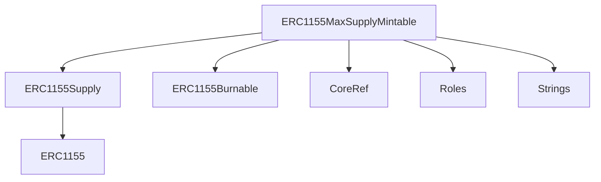
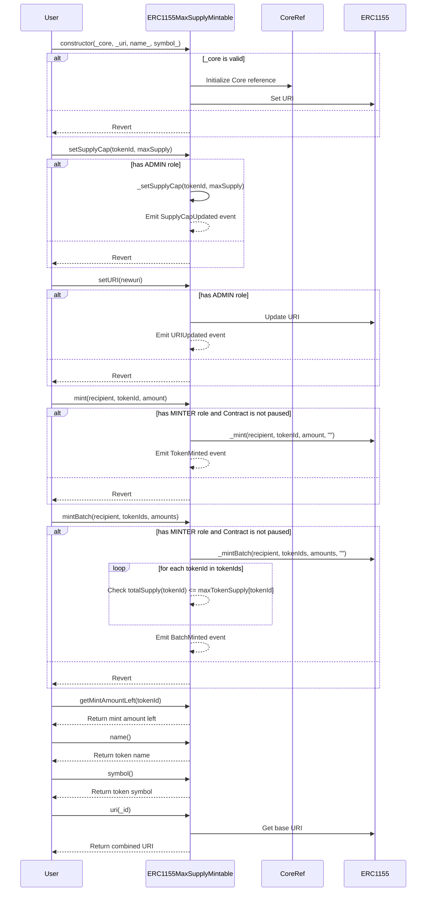

# ERC1155MaxSupplyMintable.sol

## Introduction
An extension of the standard ERC1155 multi-token interface. Designed to cater to both fungible and non-fungible tokens, it introduces a mechanism to manage the maximum supply of each individual token.

### Overview
The diagrams below provide a visual representation of how `ERC1155MaxSupplyMintable.sol` interacts with its various features and dependencies. It primarily shows the flow of actions a user can initiate and how the contract interacts with other referenced contracts and utilities.

#### Top-down

#### Sequence

## Base Contracts
### OpenZeppelin
- [ERC1155](https://github.com/OpenZeppelin/openzeppelin-contracts/blob/master/contracts/token/ERC1155/ERC1155.sol): A standardized interface for multi-token contracts. Each token in ERC1155 can represent any value (fungible, non-fungible, or a mixture).
- [ERC1155Supply](https://github.com/OpenZeppelin/openzeppelin-contracts/blob/master/contracts/token/ERC1155/extensions/ERC1155Supply.sol): Extension of the ERC1155 standard that adds tracking of the total supply for each token.
- [ERC1155Burnable](https://github.com/OpenZeppelin/openzeppelin-contracts/blob/master/contracts/token/ERC1155/extensions/ERC1155Burnable.sol): Extension of the ERC1155 standard that adds a burn function, allowing holders of tokens to destroy them.
### Protocol Specific
- [Strings](https://github.com/ZTX-Foundation/tuxedo/blob/develop/src/utils/Strings.sol): A utility library for handling string operations in Solidity.
- [Roles](https://github.com/ZTX-Foundation/tuxedo/blob/develop/src/core/Roles.sol): Manages different roles for access control.
- [CoreRef](https://github.com/ZTX-Foundation/tuxedo/blob/develop/src/refs/CoreRef.sol): Provides a reference to the protocol's core contract.

## Features
- Easily track of the total supply of each token ID.
- Enables token holders to burn (destroy) their tokens.
- Ability to change the metadata base URI.
- Setting and updating of supply caps for individual token IDs.
- Batch minting.

## Events
These events offer a mechanism to track and audit the various interactions and updates that occur within the `ERC1155MaxSupplyMintable` contract.

### `SupplyCapUpdated`
Emitted when a token's supply cap is updated.
Logs:
- `tokenId`: The ID of the token whose supply cap was updated.
- `previousMaxSupply`: The previous supply cap of the token.
- `maxSupply`: The new supply cap of the token.

### `URIUpdated`
Emitted when the metadata base URI is updated.
Logs:
- `newuri`: The new metadata base URI.

### `TokenMinted`
Emitted when a token is minted.
Logs:
- `account`: The recipient of the minted token.
- `tokenId`: The ID of the minted token.
- `amount`: The amount of tokens minted.

### `TokenBurned`
Emitted when a token is burned.
Logs:
- `account`: The holder of the burned token.
- `tokenId`: The ID of the burned token.
- `amount`: The amount of tokens burned.

### `BatchMinted`
Emitted when a batch of tokens is minted.
Logs:
- `account`: The recipient of the minted tokens.
- `tokenIds`: The IDs of the minted tokens.
- `amounts`: The amounts of tokens minted.

## Constructor
The constructor accepts four arguments:

- `_core`: The address of a core contract that provides roles and access control.
- `_uri`: The base URI for the metadata of the tokens.
- `name_`: The name of the NFT contract.
- `symbol_`: The symbol of the NFT contract.

Upon deployment, The contract initializes several contract state variables, including:

- `_name`: Stores the name of the NFT contract.
- `_symbol`: Stores the symbol of the NFT contract.

and sets up the core functionality needed for minting and managing the supply cap of individual tokens within the contract.

## Functions
### `setSupplyCap()`
Allows `ADMIN` to set the supply cap for a specific token. The new supply cap must be greater than or equal to the current supply.

### `_setSupplyCap()`
An internal function to set the supply cap for a given token. Emits a `SupplyCapUpdated` event.

### `setURI()`
Allows `ADMIN` to update the URI (metadata) for the token.

### `mint()`
Allows `MINTER` to mint tokens for a specific recipient. The number of tokens minted must not exceed the supply cap for the token. Emits a `TokenMinted` event.

### `mintBatch()`
Allows `MINTER` to mint a batch of tokens for a specific recipient. The total number of tokens minted across all IDs must not exceed the respective supply caps. Emits a `BatchMinted` event.

### `getMintAmountLeft()`
A view function that returns the amount of tokens that can still be minted before reaching the supply cap for a specific token.

### `name()`
View function that returns the name of the collection.

### `symbol()`
View function that returns the symbol of the collection.

### `_beforeTokenTransfer()`
An internal override function to disallow sending tokens to the token contract itself.

### `uri()`
A view function that generates the URI for a specific token ID, including its string representation.
