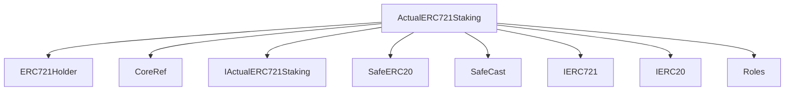
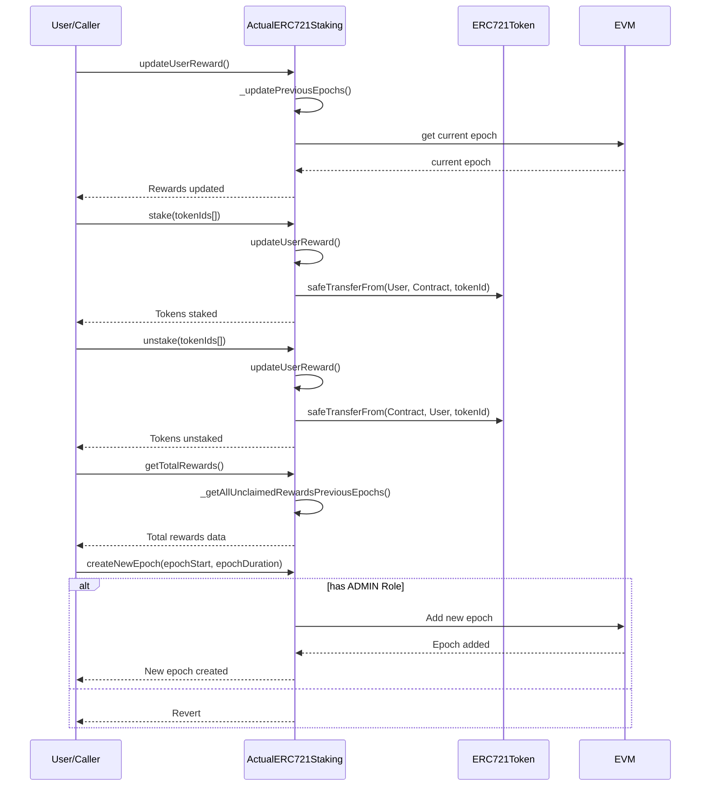

# ActualERC721Staking.sol

## Introduction
Allows users to stake their ERC721 tokens and in return, earn rewards based on specific criteria.

### Overview
The diagrams below provide a visual representation of how `ActualERC721Staking.sol` interacts with its various features and dependencies. It primarily shows the flow of actions a user can initiate and how the contract interacts with other referenced contracts and utilities.

#### Top-down

#### Sequence

## Base Contracts
### OpenZeppelin
- [ERC721Holder](https://github.com/OpenZeppelin/openzeppelin-contracts/blob/master/contracts/token/ERC721/utils/ERC721Holder.sol): This contract is designed to safely handle ERC721 tokens. It's an implementation of the `IERC721Receiver` interface, allowing the contract to receive and hold ERC721 tokens.
- [SafeERC20](https://github.com/OpenZeppelin/openzeppelin-contracts/blob/master/contracts/token/ERC20/utils/SafeERC20.sol): Adds safeguards to the standard ERC20 transfer and approve functions.
- [SafeCast](https://github.com/OpenZeppelin/openzeppelin-contracts/blob/master/contracts/utils/math/SafeCast.sol): A utility library that offers functions to safely cast between various number types without the risk of overflows or underflows.
- [IERC721](https://github.com/OpenZeppelin/openzeppelin-contracts/blob/master/contracts/token/ERC721/IERC721.sol): Interface for the ERC721 standard.
- [IERC20](https://github.com/OpenZeppelin/openzeppelin-contracts/blob/master/contracts/token/ERC20/IERC20.sol): Interface for the ERC20 standard.
### Protocol Specific
- [Roles](https://github.com/ZTX-Foundation/tuxedo/blob/develop/src/core/Roles.sol): Defines the various roles utilized within the system.
- [CoreRef](https://github.com/ZTX-Foundation/tuxedo/blob/develop/src/refs/CoreRef.sol): Provides a reference to the protocol's core contract.
- [IActualERC721Staking](https://github.com/ZTX-Foundation/tuxedo/blob/develop/src/nfts/staking/IActualERC721Staking.sol): Interface for `ActualERC721Staking`.

## Constants
- `REWARD_TIME`: The length of time to stake per point distributed.

## Constructor
The constructor accepts two arguments:

- `_core`: The address of the core contract that provides roles and access control.
- `_stakingToken`: The address of an ERC721 token contract. It is used to initialize the public variable `stakingToken`, which is an instance of the ERC721 token contract that users will be staking.

## Functions
### `epoch()`
Returns the total number of epochs that have been created.

### `getCurrentTimestampOrEpochEnd()`
Returns the end time of the current epoch for rewards calculation.

### `getClaimedRewardsAcrossAllEpochs()`
Returns the total rewards claimed by a user across all epochs.

### `getUserAmountStaked()`
Returns the total amount of ERC721 tokens staked by a user.

### `getStakedUserInfo()`
Returns information about a user's staked assets and last staked time.

### `getEpochInfo()`
Returns information about a specific epoch, including its start time and duration.

### `getTotalRewards()`
Returns the total rewards for a user across all epochs, including claimed and unclaimed rewards.

### `getElapsedTime()`
Returns the elapsed time for a user during the current epoch.

### `getUnclaimedRewardsCurrentEpoch()`
Returns the unclaimed rewards for the current epoch for a user.

### `getTotalUnclaimedRewards()`
Returns the total unclaimed rewards for a user across all epochs.

### `getCurrentEpoch()`
Returns the current epoch number, or 0 if no active epoch exists.

### `isActiveEpoch()`
Checks if a specific epoch is currently active.

