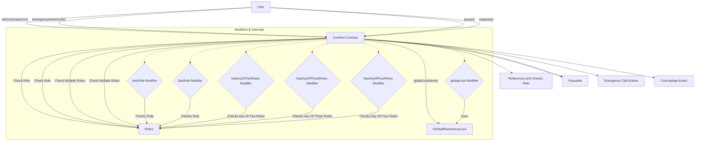
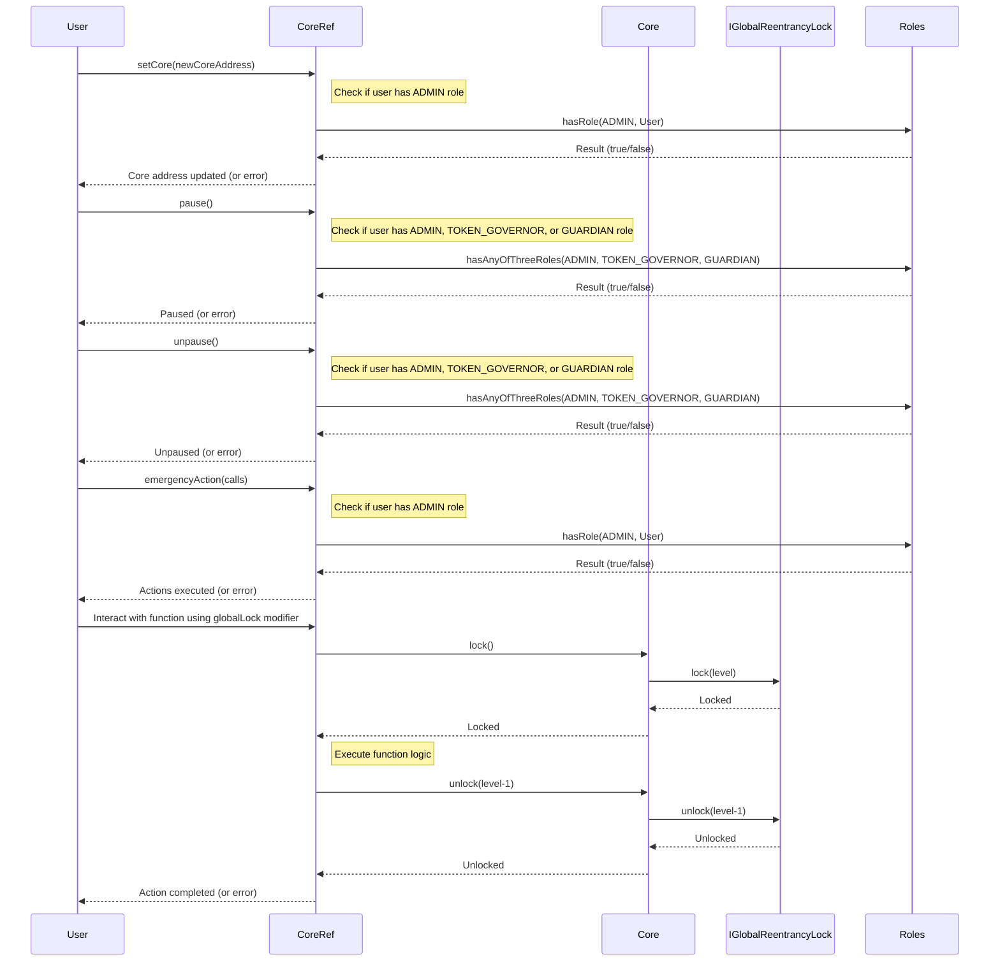

# CoreRef.sol

## Introduction
The contract serves as a foundational component within the ZTX protocol's ecosystem, providing essential functionalities that other system contracts can inherit. This contract primarily acts as a reference to `Core`, ensuring that derived contracts have a consistent access point and can perform access control checks based on the protocol's Access Control List (ACL).

### Overview
These diagrams provide a visual representation of how `CoreRef.sol` interacts with its various features and dependencies. It primarily shows the flow of actions a user can initiate and how the contract interacts with other referenced contracts and utilities.

## Base Contracts
### OpenZeppelin
* [AccessControlEnumerable](https://github.com/OpenZeppelin/openzeppelin-contracts/blob/master/contracts/access/extensions/AccessControlEnumerable.sol): This contract provides a mechanism to define roles and grant/revoke them to/from individual accounts. It offers an enumeration feature, allowing one to enumerate over all role bearers, which is an enhancement over OpenZeppelin's basic `AccessControl`.
* [Pausable](https://github.com/OpenZeppelin/openzeppelin-contracts/blob/master/contracts/utils/Pausable.sol): A contract that allows specific functionalities to be paused and resumed. This is especially useful in cases of detected vulnerabilities or during contract upgrades.
### Protocol Specific
* [IGlobalReentrancyLock](https://github.com/ZTX-Foundation/tuxedo/blob/develop/src/core/IGlobalReentrancyLock.sol): An interface that deals with reentrancy protection at a global level.
* [Core](https://github.com/ZTX-Foundation/tuxedo/blob/develop/src/core/Core.sol): The central contract for the protocol.
* [Roles](https://github.com/ZTX-Foundation/tuxedo/blob/develop/src/core/Roles.sol): Defines the various roles utilized within the system.

## Features
* Holds a reference to `Core`, enabling derived contracts to interact with and execute core functionalities.
* It integrates role-based access control mechanisms, checking permissions based on the protocol's Access Control List (ACL).
* Multiple modifiers (`onlyRole`, `hasRole`, `hasAnyOfTwoRoles`, etc.) enable granular control over function access based on roles like `ADMIN`, `TOKEN_GOVERNOR`, and more.
* Inherits from `Pausable`, which provides the ability to pause or resume functionalities as a safety measure. This can be crucial during emergencies or system upgrades.
* The `globalLock` modifier facilitates reentrancy protection, leveraging the `IGlobalReentrancyLock` interface. This safety measure ensures that recursive or nested calls do not exploit contract functions.
* Provides an `emergencyAction` function that allows executing arbitrary calldata against arbitrary addresses. This powerful feature, intended only for emergencies, can call multiple contract functions in one transaction. It's tightly controlled and is accessible only by the `ADMIN` role for security reasons.
* The contract offers the ability to point to a new `Core` address through the `setCore` function. While this offers flexibility, it comes with a cautionary note as pointing to an invalid core can potentially disrupt the system.
* Events like `CoreUpdate` provide transparency and traceability, signaling important state changes like updates to the `Core` reference.

## Events
### `CoreUpdate()`
Emitted when the reference to the core contract is updated or changed.
Logs:
- `oldCore`: The address of the previous core contract.
- `newCore`: The address of the newly set core contract.

## Modifiers
### `globalLock()`
Ensures a global reentrancy lock mechanism by interacting with the core's lock. It locks at the given level before function execution and unlocks it back to the starting level afterwards.
Parameters:
 - `level`: The level of the reentrancy lock.

### `onlyRole()`
Restricts function access based on a specific user role in the Core contract.
Parameters:
- `role`: The specific role required to execute the function.

### `hasRole()`
Similar to `onlyRole`, it restricts function access based on a user role in the Core contract. This modifier checks if the caller has the specified role but is semantically more flexible in terms of naming.
Parameters:
- `role`: The specific role required.

### `hasAnyOfTwoRoles()`
Ensures that the caller has at least one of two specified roles from the Core contract.
Parameters:
- `role1`, `role2`: The two roles, one of which is required.

### `hasAnyOfThreeRoles()`
Ensures that the caller has at least one of three specified roles.
Parameters:
- `role1`, `role2`, `role3`: The three roles, one of which is required.

### `hasAnyOfFourRoles()`
Ensures that the caller has at least one of four specified roles.
Parameters:
- `role1`, `role2`, `role3`, `role4`: The four roles, one of which is required.

## Constructor
The constructor accepts a single argument - the address of the associated `Core` contract.

## Functions
### `pause()`
Used to halt certain functionalities of derived contracts in emergencies. Restricted to users with one of three roles: `ADMIN`, `TOKEN_GOVERNOR`, or `GUARDIAN`.

### `unpause()`
Resumes functionalities that were previously halted using the pause function. Accessible by users with one of three roles: `ADMIN`, `TOKEN_GOVERNOR`, or `GUARDIAN`.

### `setCore()`
Allows updating the reference to a new Core contract. This is a sensitive action, as an invalid core can render dependent contracts non-functional. Only callable by users with the `ADMIN` role. Emits a `CoreUpdate` event, indicating the change in core reference.

### `emergencyAction()`
A versatile function that enables the execution of arbitrary calls to arbitrary addresses. It's designed as a recovery tool or to facilitate urgent changes. Accepts an array of Call structures, where each Call specifies a target address, ETH value to send, and call data. Only callable by users with the `ADMIN` role. Returns an array of bytes, representing the return data from each call.

## Design Rationale
By linking to a central `Core` contract, `CoreRef` ensures that all derived contracts have consistent access controls. Centralizing these controls makes managing roles and permissions more straightforward. Changes made in the Core contract reflect across all contracts referencing it, eliminating the need to update each contract individually.

The `globalLock` modifier leverages the `IGlobalReentrancyLock` from the `Core` contract. This provides a mechanism to prevent reentrant calls, a common attack vector in Ethereum smart contracts. By integrating this at the `CoreRef` level, it ensures all derived contracts inherit this protection, promoting safer interactions.

Multiple-role check modifiers offer flexibility, allowing functions to be accessible by various role-holders, ensuring operational continuity even if one role is compromised or unavailable.

Inheritance from the `Pausable` contract provides a mechanism to halt (pause) certain functionalities in emergencies. This can be crucial if bugs or vulnerabilities are detected.

The contract consistently checks for adverse conditions (e.g., zero addresses). Such checks help in preventing unintentional misconfigurations and ensuring the contract behaves predictably.