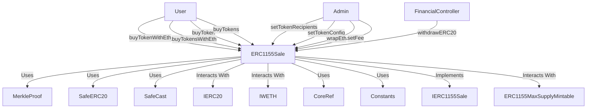
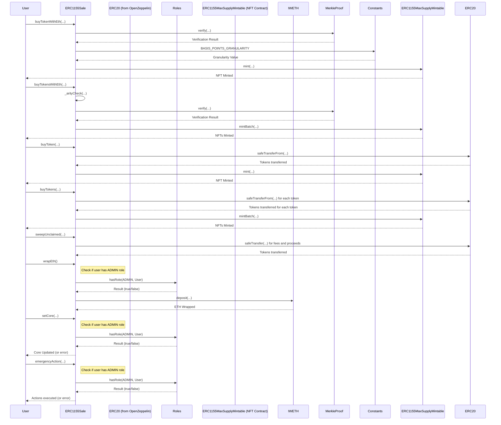

# ERC1155Sale.sol

## Introduction
Allows users to purchase ERC1155 tokens using either ETH or specific ERC20 tokens. The contract has built-in mechanisms for setting token prices, sweeping unclaimed amounts, and maintaining Merkle proofs to validate transactions. This document will provide a detailed breakdown of the contract's structure and interactions.

### Overview
These diagrams provide a visual representation of how `ERC1155Sale.sol` interacts with its various features and dependencies. It primarily shows the flow of actions a user can initiate and how the contract interacts with other referenced contracts and utilities.

## Base Contracts
### OpenZeppelin
- [MerkleProof](https://github.com/OpenZeppelin/openzeppelin-contracts/blob/master/contracts/utils/cryptography/MerkleProof.sol): Enables the verification of Merkle proofs.
- [SafeERC20](https://github.com/OpenZeppelin/openzeppelin-contracts/blob/master/contracts/token/ERC20/utils/SafeERC20.sol): Adds safeguards to the standard ERC20 transfer and approve functions.
- [SafeCast](https://github.com/OpenZeppelin/openzeppelin-contracts/blob/master/contracts/utils/math/SafeCast.sol): Safely casts between different integer types.
- [IERC20](https://github.com/OpenZeppelin/openzeppelin-contracts/blob/master/contracts/token/ERC20/IERC20.sol): Interface for the ERC20 standard.
### Protocol Specific
- [Roles](https://github.com/ZTX-Foundation/tuxedo/blob/develop/src/core/Roles.sol): Manages different roles for access control.
- [IWETH](https://github.com/ZTX-Foundation/tuxedo/blob/develop/src/interface/IWETH.sol): Interface for Wrapped Ethereum.
- [CoreRef](https://github.com/ZTX-Foundation/tuxedo/blob/develop/src/refs/CoreRef.sol): Provides a reference to the protocol's core contract.
- [Constants](https://github.com/ZTX-Foundation/tuxedo/blob/develop/src/Constants.sol): Contains various constants used across the protocol.
- [IERC1155Sale](IERC1155Sale.sol): Interface for the ERC1155 sale functionality.
- [ERC1155MaxSupplyMintable](https://github.com/ZTX-Foundation/tuxedo/blob/develop/src/nfts/ERC1155MaxSupplyMintable.sol): An ERC1155 contract that supports minting with a max supply.

## Features
* Merkle Proof Validation: Ensures the legitimacy of purchase requests.
* Safe Transfers: Implements OpenZeppelin's `SafeERC20` to ensure safe transfers of ERC20 tokens.
* Multiple Token Purchases: Allows users to purchase multiple ERC1155 tokens at once.
* Fee Handling: Implements a fee structure for purchases.
* Wrapping ETH: Converts raw Ethereum into WETH (Wrapped ETH).
* Role-based Access Control: Uses OpenZeppelin's Roles system for controlling access to administrative functions.

## Events
These events offer a mechanism to track and audit the various interactions and updates that occur within the ERC1155Sale contract, providing insights into purchases, configuration changes, and fund movements.

### `TokensPurchased`
Emitted when tokens are successfully purchased.
Logs:
- `recipient`: Address receiving the purchased tokens.
- `amount`: Amount of tokens purchased.
- `total`: Total cost (price + fees) of the purchase.

### `TokensSwept`
Emitted when unclaimed fees or proceeds are transferred to their respective destinations.
Logs:
- `recipient`: Address receiving the swept tokens.
- `amount`: Amount of tokens that were swept.

### `TokenRecipientsUpdated`
Emitted when recipients for a given purchase token are set or updated. 
Logs:
- `purchaseToken`: Address of the purchase token for which recipients are set.
- `proceedsRecipient`: Address designated to receive the proceeds from the sale. 
- `feeRecipient`: Address designated to receive the fees from the sale. 

### `TokenConfigUpdated`
Emitted when the configuration (like price, start time, etc.) for a token is set or updated. 
Logs:
- `erc1155TokenId`: ID of the ERC1155 token whose configuration is updated.
- `erc20TokenAddress`: Address of the ERC20 token in which the ERC1155 token is priced.
- `saleStartTime`: Start time of the sale.
- `price`: Price of the token in terms of the ERC20 token. 
- `fee`: Fee associated with the token sale.
- `overrideMerkleRoot`: Boolean indicating if the Merkle root is overridden.
- `merkleRoot`: The Merkle root associated with the token sale.

### `FeeUpdated`
Emitted when the fee for an ERC1155 token is updated.
Logs:
- `tokenId`: ID of the ERC1155 token whose fee is updated. 
- `fee`: Updated fee value.

### `WithdrawERC20`
Emitted when ERC20 tokens are withdrawn from the contract, typically in emergency situations. 
Logs:
- `caller`: Address that initiated the withdrawal.
- `token`: Address of the ERC20 token that's withdrawn.
- `to`: Destination address receiving the withdrawn tokens.
- `amount`: Amount of tokens that were withdrawn.

## Structs
### `TokenInfo`
Stores information related to a specific token, including:
- the token's price,
- sale start time,
- the ERC20 token in which the ERC1155 token is priced 
- and a merkle root for verification purposes.

### `TokenRecipient`
Keeps track of the recipients for token proceeds and fees. Also manages unclaimed amounts.

## Constructor
The constructor accepts three arguments:

* `_core`: An address representing the core contract.
* `_nft`: An address representing the ERC1155 contract.
* `_weth`: An address representing the WETH (Wrapped Ethereum) contract.

The constructor doesn't have any explicit modifiers, but it contains checks to ensure non-zero addresses for `_nft` and `_weth`.

## Functions
### `buyTokenWithEth()`
Allows a user to purchase ERC1155 tokens using raw Ethereum, ensures the sale has started and provided ETH matches the calculated total cost, mints the ERC1155 tokens to the recipient and emits a `TokensPurchased` event.

###  `buyTokensWithEth()`
Allows a user to bulk purchase multiple ERC1155 tokens using raw Ethereum, validates provided ETH matches the bulk purchase total and mints the ERC1155 tokens in a batch to the recipient.

### `buyToken()`
Allows a user to purchase ERC1155 tokens using ERC20 tokens, ensures the sale has started, checks the approved amount, and transfers ERC20 from the buyer, mints the ERC1155 tokens to the recipient and emits a `TokensPurchased` event.

### `buyTokens()`
Enables bulk purchasing of multiple ERC1155 tokens using ERC20 tokens. Transfers ERC20 tokens from the buyer for each purchase. Mints the ERC1155 tokens in a batch to the recipient.

### `sweepUnclaimed()`
Allows transferring unclaimed fees and proceeds to the respective destinations for a given purchase token and emits two `TokensSwept` events, one for fees and one for proceeds. 

### `wrapEth()`
Admin-only function to convert raw Ethereum held in the contract to WETH (Wrapped Ethereum). 

###  `setTokenRecipients()`
Admin-only function to set recipients for a given purchase token and emits a `TokenRecipientsUpdated` event.

### `setTokenConfig()`
Admin-only function to set the price and configuration of a token in terms of an ERC20 token and emits a `TokenConfigUpdated` event.

###  `setFee()`
Token governor or admin function to set the fee associated with a given ERC1155 token and emits a `FeeUpdated` event.

###  `withdrawERC20()`
A FinancialController-only function used in emergency situations to withdraw ERC20 tokens from the contract. Emits a `WithdrawERC20` event.

###  `_helperBuyWithEth()`
Internal function to facilitate buying with ETH.

### `_arityCheck()`
Private function to ensure consistent array lengths for bulk operations.

### `_buyTokenChecks()`
Internal function for checks and effects when buying tokens.

### `_buyTokenWithEthChecks()`
Private function for specific checks when buying tokens with ETH.

### `getTokenRecipientsAndUnclaimed()`
Fetches token recipients and unclaimed amounts for a given purchase token.

### `getTokenInfo()`
Retrieves information for a given token ID.

### `getPurchasePrice()`
Calculates the purchase price for a token.

###  `getBulkPurchaseTotal()`
Computes the total cost for a bulk purchase.

###  `getMaxMintAmountOut()`
Gets the maximum mint amount remaining for a token.

### `isRootOverriden()`
Checks if the Merkle root for a token is overridden.

## Roles
The contract uses a role-based access control mechanism, primarily through the `Roles` contract. This allows specific operations (like changing token configurations or handling emergencies) to be restricted to certain roles, like `ADMIN`, `TOKEN_GOVERNOR`, and `FINANCIAL_CONTROLLER`. This setup ensures that critical operations can only be executed by trusted entities, adding security and governance to the system.

## Design Rationale
`MerkleProof` ensures that purchase requests are legitimate by allowing for the verification of Merkle proofs. This adds a layer of security to the contract, ensuring that only approved purchases can be made.

`SafeERC20` standardizes ERC20 token transfers, ensuring they execute correctly and securely.

In Solidity, typecasting can lead to overflows or underflows if not done carefully. `SafeCast` provides safe casting methods that revert in case of an overflow or underflow, adding an extra layer of security.

`IERC20` is the standard interface for ERC20 tokens. By adhering to this interface, the contract ensures compatibility with a wide range of ERC20 tokens.

