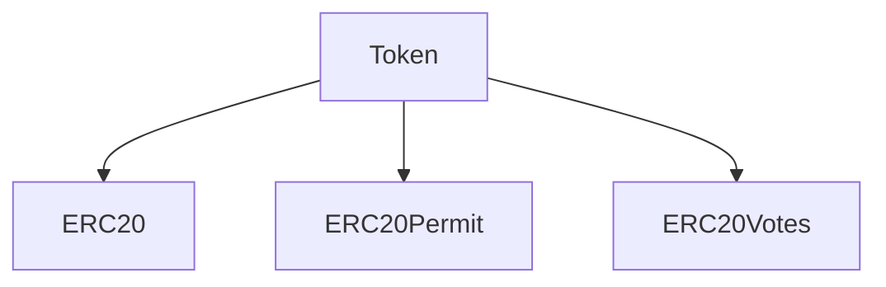
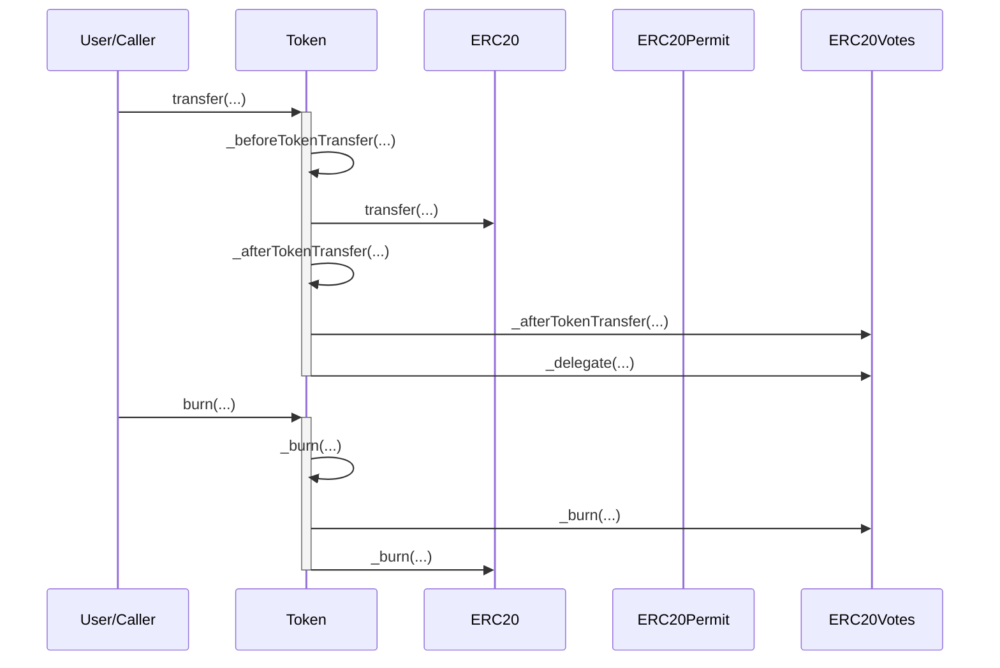

# Token.sol

## Introduction
Custom implementation built upon several extensions of the OpenZeppelin's ERC20 standard token contract. This documentation provides a comprehensive architectural review of the contract. 

### Overview
These diagrams provide a visual representation of how `Token.sol` interacts with its various features and dependencies. It primarily shows the flow of actions a user can initiate and how the contract interacts with other referenced contracts and utilities.

#### Top-down

#### Sequence

## Base Contracts
### OpenZeppelin
- [ERC20](https://github.com/OpenZeppelin/openzeppelin-contracts/blob/master/contracts/token/ERC20/ERC20.sol): This is the core implementation provided by OpenZeppelin for the ERC20 standard, which is a widely-used fungible token standard on Ethereum.
- [ERC20Permit](https://github.com/OpenZeppelin/openzeppelin-contracts/blob/master/contracts/token/ERC20/extensions/ERC20Permit.sol): An extension of ERC20 that introduces a permit function, which allows holders to give a spender allowance to transfer tokens with a signed message, eliminating the need for an initial transaction to approve the transfer.
- [ERC20Votes](https://github.com/OpenZeppelin/openzeppelin-contracts/blob/master/contracts/token/ERC20/extensions/ERC20Votes.sol): An extension of ERC20 that facilitates on-chain voting with token-backed votes.

## Features
- Non-Burnable: The contract does not allow burning tokens, meaning tokens once minted cannot be destroyed.
- Fixed Supply: The contract has a fixed maximum supply of 10 billion tokens (10^10) with 18 decimals. This means no new tokens can be minted beyond this limit.
- Delegation: Automatically delegate to self, and anyone can cause you to delegate to self. This is an intentional design decision.

## Constants
- `MAX_SUPPLY`: Represents the maximum supply of the token, which is 10 billion tokens with 18 decimals.

## Constructor
The constructor accepts two arguments:

- `name`: Represents the name of the token.
- `symbol`: Represents the symbol or ticker of the token.

Upon deployment, the contract mints the `MAX_SUPPLY` of tokens and assigns them to the deployer of the contract. 

## Functions
### `maxSupply()`
A public pure function that returns the maximum supply of tokens.

### `_beforeTokenTransfer()`
An internal virtual function provided by `ERC20Votes` that is called before every token transfer. Ensures that the `_beforeTokenTransfer` function from the `ERC20` contract is called.

### `_afterTokenTransfer()`
An internal virtual function provided by `ERC20Votes` that is called after every token transfer. Calls the `_delegate` function to update the voting delegation.

### `_burn()`
An internal virtual function provided by `ERC20Votes` and `ERC20` that is used to burn tokens from an account. Calls the `_burn` functions of both parent contracts.

### `_mint()`
An internal virtual function provided by `ERC20Votes` and `ERC20` that is used to mint tokens and add them to an account. Calls the `_mint` functions of both parent contracts.

## Design Rationale
The `ERC20Permit` extension is used to eliminate the need for two transactions when a user wants to spend another user's tokens. Traditionally, the token owner would first need to approve the spender, and then the spender would call transferFrom. With permit, the owner can sign a message off-chain that gives the spender permission, and the spender can then submit this permission on-chain in a single transaction.

The `ERC20Votes` extension is used to enable on-chain voting using the token. Token holders can delegate their voting power or vote on proposals. The _afterTokenTransfer hook ensures that voting power is correctly adjusted after any token transfer.
