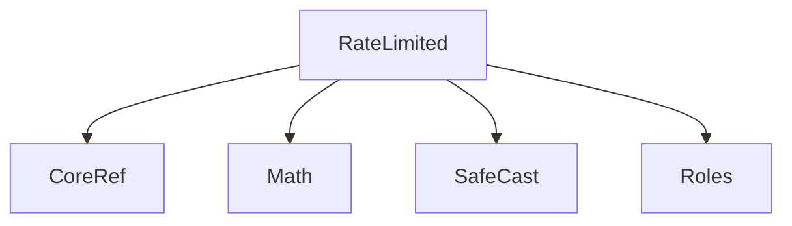
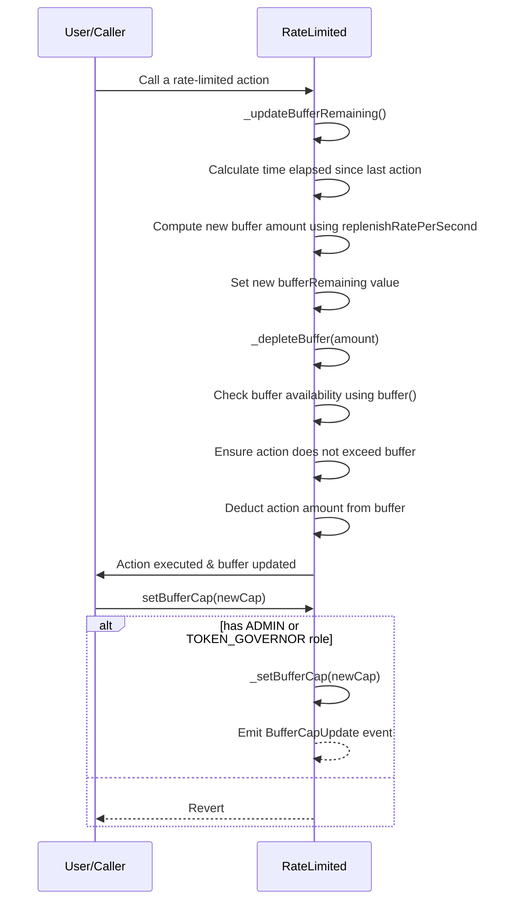

# RateLimited.sol

## Introduction
An abstract contract designed to enforce rate limits on specific actions, such as minting. Such rate-limiting mechanisms are essential for applications that require operational safety limits, ensuring that actions cannot be excessively executed in short time frames, which might expose the system to risks or abuse.

### Overview
The diagrams below provide a visual representation of how `RateLimited.sol` interacts with its various features and dependencies. It primarily shows the flow of actions a user can initiate and how the contract interacts with other referenced contracts and utilities.

#### Top-down

#### Sequence

## Base Contracts
### OpenZeppelin
- [Math](https://github.com/OpenZeppelin/openzeppelin-contracts/blob/master/contracts/utils/math/Math.sol): Common Solidity math functions.
- [SafeCast](https://github.com/OpenZeppelin/openzeppelin-contracts/blob/master/contracts/utils/math/SafeCast.sol): A utility library that offers functions to safely cast between various number types without the risk of overflows or underflows.
### Protocol Specific
- [Roles](https://github.com/ZTX-Foundation/tuxedo/blob/develop/src/core/Roles.sol): Defines the various roles utilized within the system.
- [CoreRef](https://github.com/ZTX-Foundation/tuxedo/blob/develop/src/refs/CoreRef.sol): Provides a reference to the protocol's core contract.
