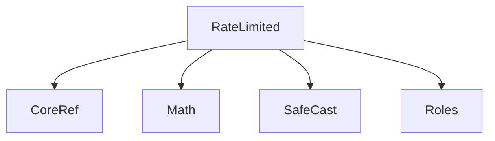
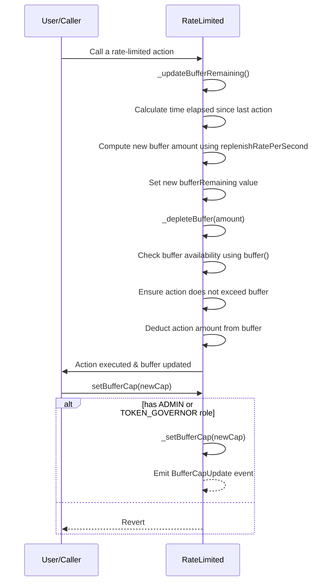

# RateLimited.sol

## Introduction
An abstract contract designed to enforce rate limits on specific actions, such as minting. Such rate-limiting mechanisms are essential for applications that require operational safety limits, ensuring that actions cannot be excessively executed in short time frames, which might expose the system to risks or abuse.

### Overview
The diagrams below provide a visual representation of how `RateLimited.sol` interacts with its various features and dependencies. It primarily shows the flow of actions a user can initiate and how the contract interacts with other referenced contracts and utilities.

#### Top-down

#### Sequence

## Base Contracts
### OpenZeppelin
- [Math](https://github.com/OpenZeppelin/openzeppelin-contracts/blob/master/contracts/utils/math/Math.sol): Common Solidity math functions.
- [SafeCast](https://github.com/OpenZeppelin/openzeppelin-contracts/blob/master/contracts/utils/math/SafeCast.sol): A utility library that offers functions to safely cast between various number types without the risk of overflows or underflows.
### Protocol Specific
- [Roles](https://github.com/ZTX-Foundation/tuxedo/blob/develop/src/core/Roles.sol): Defines the various roles utilized within the system.
- [CoreRef](https://github.com/ZTX-Foundation/tuxedo/blob/develop/src/refs/CoreRef.sol): Provides a reference to the protocol's core contract.

## Features
- Allows other contracts to implement rate limits on specific actions. It provides a mechanism to limit how quickly a contract can perform certain actions, such as minting tokens.
- Provides flexibility in controlling the pace of certain operations within the ZTX protocol.

## Events
### `BufferUsed`
Emitted when buffer gets eaten into.
Logs:
- `amountUsed`: The amount of buffer used.
- `amountRemaining`: The amount of buffer remaining.

### `BufferReplenished`
Emitted when buffer gets replenished.
Logs:
- `amountReplenished`: The amount of buffer replenished.
- `bufferRemaining`: The amount of buffer remaining.

### `BufferCapUpdate`
Emitted when the buffer cap is updated.
Logs:
- `oldBufferCap`: The previous buffer cap.
- `newBufferCap`: The new buffer cap.

### `ReplenishRatePerSecondUpdate`
Emitted when the replenish rate per second is updated.
Logs:
- `oldReplenishRatePerSecond`: The previous replenish rate per second.
- `newReplenishRatePerSecond`: The new replenish rate per second.

## Constructor
The constructor accepts two arguments:

- `_replenishRatePerSecond`: Specifies the rate at which the contract's buffer is replenished per second.
- `_bufferCap`: Sets the maximum size (cap) of the buffer that can be used at once.

Upon deployment, the contract's replenish rate and buffer cap are set to the values provided.

## Functions
### `setReplenishRatePerSecond()`
Allows an authorized user with specific roles (e.g., `TOKEN_GOVERNOR` or `ADMIN`) to update the rate at which the buffer replenishes per second. Calls `_updateBufferRemaining()` to refresh the buffer state.

### `setBufferCap()`
Allows an authorized user with specific roles (e.g., TOKEN_GOVERNOR or ADMIN) to update the buffer capacity. Calls `_updateBufferRemaining()` to refresh the buffer state.

### `buffer()`
A view function that calculates the current amount of action that can be performed before reaching the rate limit. It considers the time elapsed since the last buffer update and ensures that the buffer does not exceed the bufferCap.

### `_depleteBuffer()`
An internal function that enforces the rate limit by reducing the buffer by a specified amount. If the buffer is insufficient, it either partially performs the action or reverts, depending on the value of `doPartialAction`.

### `_setReplenishRatePerSecond()`
An internal function to update the replenishRatePerSecond state variable. Emits a `ReplenishRatePerSecondUpdate` event.

### `_setBufferCap()`
An internal function to update the bufferCap state variable. Emits a `BufferCapUpdate` event.

### `_updateBufferRemaining()`
An internal function that updates the `bufferRemaining` and `lastBufferUsedTime` based on the current timestamp and the calculated buffer value.
