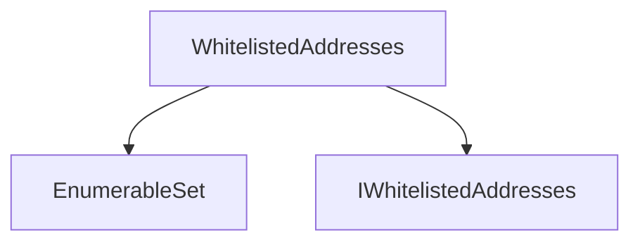
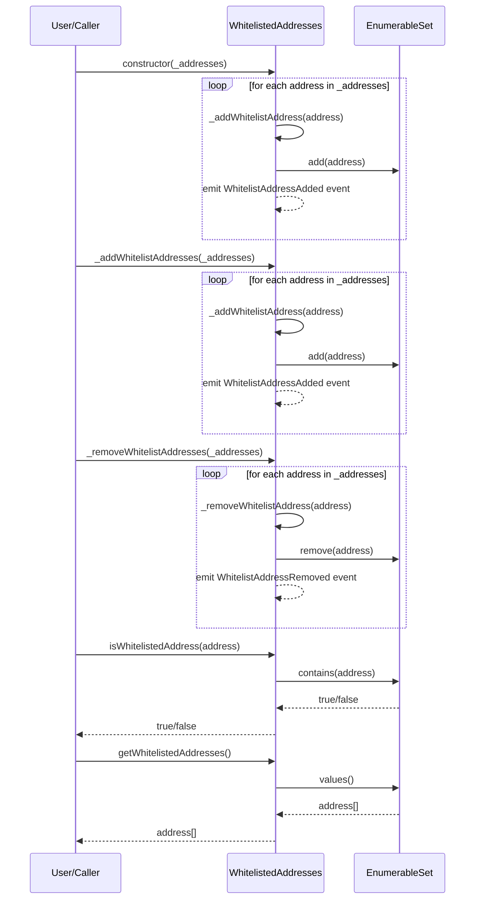

# WhitelistedAddresses.sol

## Introduction
A mechanism to maintain and validate a list of approved addresses. The contract ensures that each address on the whitelist is unique and allows for easy enumeration of whitelisted addresses.

### Overview
The diagrams below provide a visual representation of how `WhitelistedAddresses.sol` interacts with its various features and dependencies. It primarily shows the flow of actions a user can initiate and how the contract interacts with other referenced contracts and utilities.

#### Top-down

#### Sequence

## Base Contracts
### OpenZeppelin
- [EnumerableSet](https://github.com/OpenZeppelin/openzeppelin-contracts/blob/master/contracts/utils/structs/EnumerableSet.sol): Manages a set of unique addresses. It allows for the addition and removal of elements and ensures that each element is unique.
### Protocol Specific
- [IWhitelistedAddresses](https://github.com/ZTX-Foundation/tuxedo/blob/develop/src/utils/extensions/IWhitelistedAddreses.sol): Interface for `WhitelistedAddreses`.