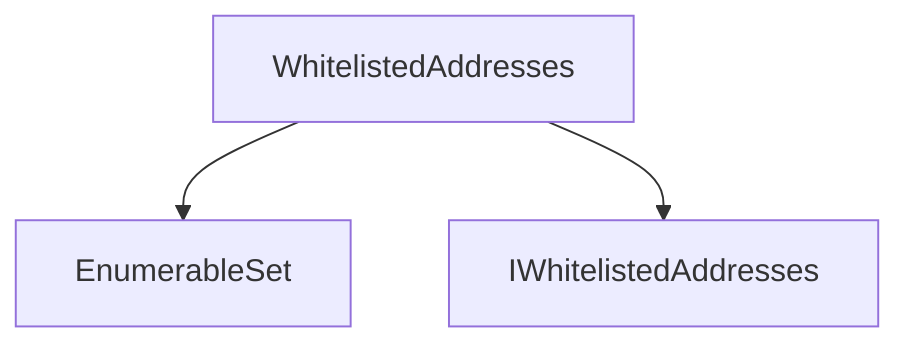
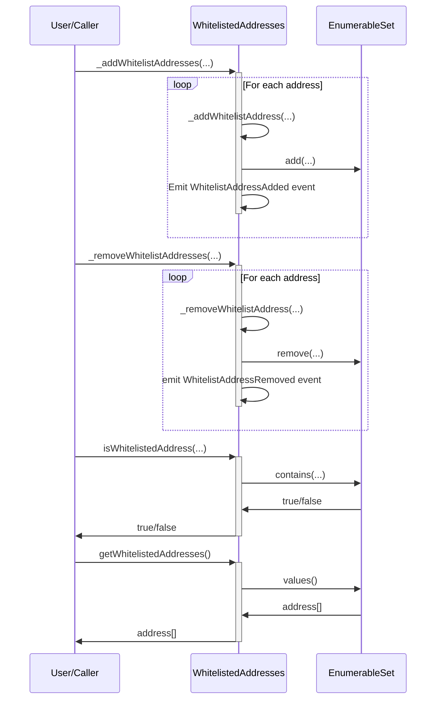

# WhitelistedAddresses.sol

## Introduction
A mechanism to maintain and validate a list of approved addresses. The contract ensures that each address on the whitelist is unique and allows for easy enumeration of whitelisted addresses.

### Overview
The diagrams below provide a visual representation of how `WhitelistedAddresses.sol` interacts with its various features and dependencies. It primarily shows the flow of actions a user can initiate and how the contract interacts with other referenced contracts and utilities.

#### Top-down

#### Sequence

## Base Contracts
### OpenZeppelin
- [EnumerableSet](https://github.com/OpenZeppelin/openzeppelin-contracts/blob/master/contracts/utils/structs/EnumerableSet.sol): Manages a set of unique addresses. It allows for the addition and removal of elements and ensures that each element is unique.
### Protocol Specific
- [IWhitelistedAddresses](https://github.com/ZTX-Foundation/tuxedo/blob/develop/src/utils/extensions/IWhitelistedAddreses.sol): Interface for `WhitelistedAddreses`.

## Features
- Can be inherited by other contracts that need to implement whitelisting functionality for specific actions or access control.
- Allows certain addresses to be added to and removed from the whitelist, and it provides functions to check whether an address is whitelisted.
- Stores the whitelisted addresses in a set, ensuring uniqueness and efficient lookups.
- Provides a convenient and reusable way to manage whitelists of addresses within the ZTX protocol.

## Modifiers
### `onlyWhitelist()`
Checks if a deposit address is whitelisted.
Parameters:
- `addr`: The address to check.

## Constructor
The constructor accepts a single argument:

- `_addresses`: An array of addresses to whitelist.

Upon deployment, the contract populates its whitelist with the addresses provided in the `_addresses` array, ensuring that these addresses are allowed to interact with the contract's functions that use the `onlyWhitelist` modifier.

## Functions
### `_addWhitelistAddress()`
An internal function used to add a single address to the whitelist. It emits an event, `WhitelistAddressAdded`, when an address is successfully added.

### `_removeWhitelistAddress()`
An internal function used to remove a single address from the whitelist. It emits an event, `WhitelistAddressRemoved`, when an address is successfully removed.

### `_addWhitelistAddresses()`
An internal function used to add multiple addresses to the whitelist. It iterates through an array of addresses and calls `_addWhitelistAddress` for each one.

### `_removeWhitelistAddresses()`
An internal function used to remove multiple addresses from the whitelist. It iterates through an array of addresses and calls `_removeWhitelistAddress` for each one.

### `isWhitelistedAddress()`
A public view function that checks if a given address is whitelisted. It returns true if the address is on the whitelist and false otherwise.

### `getWhitelistedAddresses()`
An external function that returns an array containing all the whitelisted addresses. This function allows anyone to query the current whitelist.
