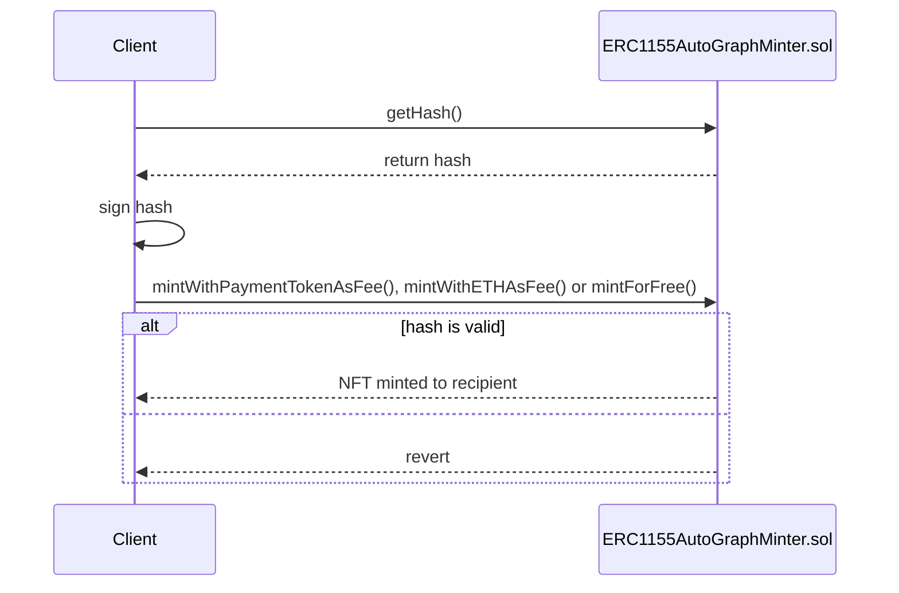

# Crafting

## Introduction
This feature covers the basics of crafting from within the game, as it relates to the ZTX protocol contracts. Similar to harvesting, crafting can also be expedited.

## Expedite
Refer to the [Harvesting](./Harvesting.md) documentation for further details on expediting the process, as it's identical for crafting.

## Instant Crafting
In addition to expediting a crafting job (reducing the amount of time the user has to wait), it's also possible to instantly craft an item for a fee instead. This is done by paying a fee in either `$ZTX` or `ETH`.

The two functions for instant crafting are:

- `mintWithPaymentTokenAsFee()` (see [here](../contracts/nfts/ERC1155AutoGraphMinter.md#mintWithPaymentTokenAsFee)
- `mintWithETHAsFee()` (see [here](../contracts/nfts/ERC1155AutoGraphMinter.md#mintWithETHAsFee)

## Free Crafting
The function `mintForFree()` would be used to mint an NFT after the crafting time has lapsed (irrespective of whether the job was expedited or not). See [here](../contracts/nfts/ERC1155AutoGraphMinter.md#mintForFree) for more details.

## Generate a signed hash
Before minting an NFT, you'll need to generate a signed hash. The hash must be signed by an EOA that has the `MINTER_NOTARY` role. The hash can be generated off-chain or on-chain. 

To generate the hash on-chain, you need to call `getHash()`. See [ERC1155AutoGraphMinter](../contracts/nfts/ERC1155AutoGraphMinter.md#getHash) for more details.

Please also refer to the [example scripts](../../script/utils/nfts) for more details on how to generate a hash (`getHash.ts`) (either on-chain or off-chain), and sign said hash (`signHash.ts`).

## Sequence

