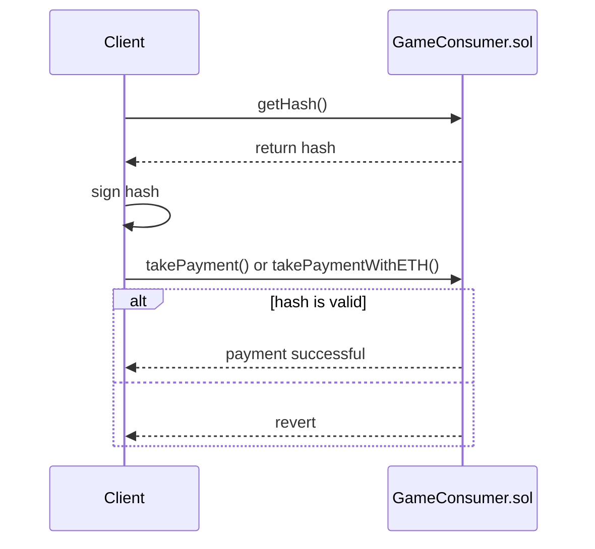

# Harvesting

## Introduction
This feature covers the basics of harvesting from within the game, as it relates to the ZTX protocol contracts. Harvesting does not involve NFTs.

## Expedite
During the game, it's possible that a user may wish to expedite their harvesting for a fee. The fee can be paid in either `$ZTX` or `ETH`. The contract just takes payment and emits an event. It does not change game state.

### Generate a signed hash
Before taking payment, you need to generate a signed hash. The hash must be signed by an EOA that has the `GAME_CONSUMER_NOTARY` role. The hash can be generated off-chain or on-chain. To generate the hash on-chain, you need to call `getHash()`. See [GameConsumer](../contracts/game/GameConsumer.md#gethash) for more details.

Refer to the [example scripts](../../script/utils/game) for more details on how to generate a hash (either on-chain or off-chain), and sign said hash.

### Sequence

